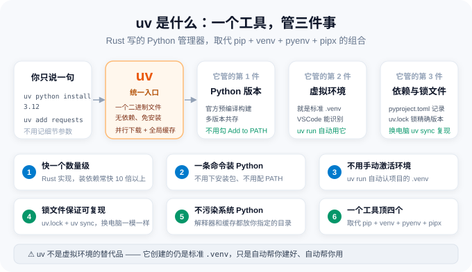
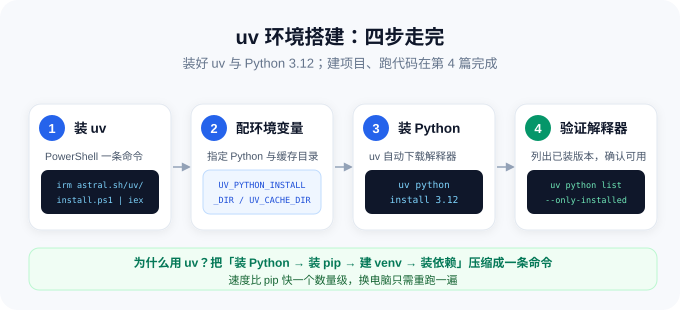

# 第 3 篇：用 WorkBuddy 装好 uv 和 Python 3.12

> **一句话结论**
> 别再从 python.org 下载安装包、手点「Add to PATH」了。
> 这一篇**把整件事交给 WorkBuddy**：复制一段提示词 → 切到「允许完全访问」→ 发送 → 等它跑完。
> **本篇只装系统环境**（uv + Python），**不建项目、不建虚拟环境**——那两步在第 4、5 篇里做。

<a id="sec-what-is-uv"></a>

## 一、先认识 uv：它到底是什么

在让 AI 动手之前，先花 3 分钟搞清你要装的这个东西是什么——**不然出了问题你连问都没法问**。

### 1.1 uv 是什么

**uv** 是由 Astral 公司（也就是做 Ruff 那个团队）用 **Rust** 写的 Python 工具。
它是一个**单独的二进制文件**，没有依赖、不用装 Python 就能运行。

官方对它的定位是：**一个极快的 Python 包与项目管理器**。
直白点说——**它把 pip、virtualenv、pyenv、pipx 这四个工具的活儿，全揽到一个命令里了**。

### 1.2 它管三件事



| 它管的 | 传统做法要装什么 | 用 uv 怎么做 |
| :--- | :--- | :--- |
| **Python 版本** | 去 python.org 下安装包，或折腾 pyenv | `uv python install 3.12` |
| **虚拟环境** | `python -m venv .venv` + 每次手动激活 | `uv venv` / `uv run` 自动用 |
| **依赖包** | `pip install`，外加手动维护 requirements.txt | `uv add requests`，自动生成 `uv.lock` |

### 1.3 ⭐ 用 uv 管理的六个优势

**1）快一个数量级**
Rust 实现 + 并行下载 + 全局缓存，装依赖通常比 pip **快 10 倍以上**。
同一个项目第二次安装几乎是秒完——因为包已经在缓存里了。

**2）一条命令装 Python，不用碰官网、不用勾 PATH**
`uv python install 3.12` 会用官方预编译构建，装到 `UV_PYTHON_INSTALL_DIR` 指定的目录。
**想卸干净？删掉那个文件夹就行**，不会在系统里留下注册表和环境变量残渣。

**3）不用手动激活环境（新手最容易忘的一步被消灭了）**
传统流程是「先 `.\.venv\Scripts\activate` 激活，再 `python xxx.py`」——
**忘了激活，包就装到系统 Python 里去了**，这是新手最常见的混乱来源。
uv 的做法是：`uv run xxx.py`，它**自动找到并使用项目的 `.venv`**，你什么都不用记。

**4）锁文件保证可复现**
`uv add` 会同时写入 `pyproject.toml`（声明）和 `uv.lock`（精确版本）。
把这两个文件拷到任何一台机器，跑 `uv sync`，得到的环境**和你这边一模一样**。
传统 `requirements.txt` 只能记录直接依赖、还常常不锁版本，换台机器就对不上。

**5）完全不污染系统 Python**
所有解释器在 `UV_PYTHON_INSTALL_DIR` 里，所有缓存在 `UV_CACHE_DIR` 里，
项目的包在各自的 `.venv` 里。**系统里那个 Python 从头到尾没被动过**。

**6）一个工具顶四个，心智负担小**

| 传统组合 | uv 里的对应命令 |
| :--- | :--- |
| pyenv | `uv python install / list / pin` |
| virtualenv / venv | `uv venv` |
| pip / pip-tools | `uv add / remove / pip install` |
| pipx | `uv tool install` |

### 1.4 一个常见误解，提前说清

> ⚠️ **uv 不是虚拟环境的替代品。**
> 它创建的**仍然是标准的 `.venv` 目录**，和你用 `python -m venv` 建的一模一样。
> 区别只在于：uv **自动帮你建好、自动帮你选中、自动帮你用**。
>
> 这个区别很重要——正因为是标准的 `.venv`，**VSCode 的 Python 扩展才能正常识别它**，
> 你在第 4、5 篇里「选解释器」时才选得到它。

### 1.5 心智模型：东西都在哪儿

```
你的电脑
├── D:\Tools\uv\python\          ← UV_PYTHON_INSTALL_DIR
│   └── cpython-3.12.x\          ← uv 装的 Python（多个版本共存）
├── D:\Tools\uv\cache\           ← UV_CACHE_DIR
│   └── 下载过的所有依赖包（全局复用，所以快）
└── D:\Code\你的项目\
    ├── .venv\                   ← 本项目的虚拟环境（软链接回上面的解释器）
    ├── pyproject.toml           ← 声明：「我要 requests」
    └── uv.lock                  ← 锁定：「requests 2.32.3，以及它的 12 个间接依赖」
```

记住这张图，后面出任何环境问题时，你都能**按图索骥地判断「东西应该在哪个文件夹」**。

---

## 二、为什么这一步交给 WorkBuddy

手动装 Python 的麻烦不在于难，而在于**琐碎且容易漏**：

| 环节 | 手动装要操心什么 | 交给 WorkBuddy 之后 |
| :--- | :--- | :--- |
| 装 uv | 选 winget 还是 scoop？装完要不要重开终端？ | 它自己探测、自动选、自动验证 |
| 配环境变量 | 用户级还是系统级？路径写错没有？ | 它按你的磁盘布局写入并**逐条回读确认** |
| 装 Python | 版本补丁号存不存在？装到哪儿了？ | 找不到精确版本会自动降级并**告诉你装到了哪个** |
| 验证 | 装完到底能不能跑？ | 它**实际执行一次**解释器并把输出贴给你 |
| 出问题 | 自己搜报错 | 它自行诊断修复，最后附「踩坑记录」 |

**你要做的只有一件事**：把下面这段提示词复制进去。

---

## 三、⭐ 一键提示词：整段复制给 WorkBuddy

### 3.1 发送前的三个准备

| # | 要做什么 | 说明 |
| :---: | :--- | :--- |
| 1 | **切到「允许完全访问」** | 只有该模式能读写文件、执行终端命令，装环境必须用它 |
| 2 | **确认积分已领** | 见 [第 1 篇 · 4.3 免费积分](01-VSCode与WorkBuddy安装与汉化.md#sec-wb-points) |
| 3 | **改一下提示词里的路径** | 默认是 `D:\Tools\uv`。如果没有 D 盘，改成 `C:\Tools\uv` |

### 3.2 完整版提示词

> 复制下面**整个代码块**的内容，粘贴到 WorkBuddy 的输入框，发送即可。

````text
# 任务：在 Windows 上安装 uv，并用 uv 装好 Python 3.12

## 你的角色
你是一名 Windows 环境配置工程师。请按步骤执行，每一步都要实际运行命令验证，
不要假设成功。遇到报错要自行诊断并修复，最后输出一份结构化报告。

## 基本信息
- 目标系统：Windows 10/11
- Shell：PowerShell（如需 CMD 请显式说明）
- uv 安装目录：D:\Tools\uv
- Python 统一安装目录：D:\Tools\uv\python
- uv 缓存目录：D:\Tools\uv\cache
- 目标 Python 版本：3.12

## 执行步骤

### 第 1 步：环境体检
1. 输出当前系统信息和 PowerShell 版本。
2. 检查是否已安装 uv：运行 `uv --version`。
3. 检查是否已有 Python：运行 `python --version`、`py -0p`。
4. 检查 uv 安装目录所在盘（默认 D 盘）是否存在、是否有写入权限。
把体检结果先简要汇报，再继续。

### 第 2 步：安装 uv
按以下优先级尝试，成功一个就停止：
1. `winget install --id=astral-sh.uv -e`
2. `powershell -ExecutionPolicy ByPass -c "irm https://astral.sh/uv/install.ps1 | iex"`
3. `scoop install uv`
安装后**必须关闭并重新打开终端**（或重新加载 PATH），再运行 `uv --version` 验证。
如果提示「uv 不是内部或外部命令」，请把 %USERPROFILE%\.local\bin 加入用户 PATH 后重试。

### 第 3 步：配置 uv 环境变量（用户级，不污染系统）
执行以下三条：
[Environment]::SetEnvironmentVariable("UV_PYTHON_INSTALL_DIR", "D:\Tools\uv\python", "User")
[Environment]::SetEnvironmentVariable("UV_CACHE_DIR", "D:\Tools\uv\cache", "User")
[Environment]::SetEnvironmentVariable("UV_LINK_MODE", "copy", "User")
配置完成后，用 `[Environment]::GetEnvironmentVariable("变量名","User")` 回读这三个变量确认已写入（同一会话的 `$env:` 不会自动更新，需新开终端才生效）。

### 第 4 步：安装 Python 3.12
1. 运行 `uv python install 3.12`（若我想要精确补丁版本，会另行告知）。
2. 运行 `uv python list --only-installed` 列出已安装解释器，明确告诉我实际版本号。

### 第 5 步：验证解释器可执行
1. 运行 `uv python find 3.12`，记录返回的解释器绝对路径。
2. 直接调用该解释器验证它真的能跑：
   & (uv python find 3.12) -c "import sys; print(sys.version); print(sys.executable)"
3. 贴出完整输出。

### 第 6 步：收尾报告
用表格输出以下内容：
| 检查项 | 结果 |
| uv 版本 | |
| uv 可执行文件路径 | |
| Python 版本 | |
| 解释器绝对路径 | |
| UV_PYTHON_INSTALL_DIR | |
| UV_CACHE_DIR | |
| 环境变量是否生效 | |
| 解释器能否正常执行 | |

最后再补两段：
1. 「本次踩到的坑及解决办法」
2. 「后续常用命令清单」

## 约束
- 不要修改系统级环境变量，只用用户级（User）。
- 不要卸载或改动系统已有的 Python。
- **不要创建项目、不要建虚拟环境** —— 那是下一步在 VSCode 里做的事。
- 每一步都要贴出你实际执行的命令和真实输出，禁止编造。
- 如果某一步无法完成，停下来告诉我原因和可选方案，不要跳过继续。
````

### 3.3 极简版提示词（懒人专用）

````text
请在 Windows 上帮我完成以下配置，每步都要实际执行并验证：
1. 安装 uv（优先 winget install --id=astral-sh.uv -e，失败则用官方 PowerShell 脚本）
2. 设置用户级环境变量 UV_PYTHON_INSTALL_DIR=D:\Tools\uv\python、UV_CACHE_DIR=D:\Tools\uv\cache
3. uv python install 3.12，再用 uv python list --only-installed 确认
4. 用 & (uv python find 3.12) -c "import sys; print(sys.version); print(sys.executable)" 验证解释器能跑
每一步都要贴出你实际执行的命令和真实输出，禁止编造。
不要修改系统级环境变量；不要改动系统已有的 Python。
如果某一步做不到，停下来告诉我原因和可选方案，不要跳过继续。
最后给我一份检查清单表格，列出每项的实际结果。
不要创建项目、也不要建虚拟环境 —— 那些我在 VSCode 里自己做。
````

> 💡 **想指定精确版本？** 把提示词里的 `3.12` 换成 `3.12.13` 即可。
> 如果该补丁版本没有官方预编译包，WorkBuddy 会按提示词要求**自动降级到 3.12 并告诉你实际版本**。

---

## 四、发送之后，你会看到什么



大致流程如下，**中间不用你干预**（除非它主动提问）：

```
① 环境体检汇报
   系统版本 / PowerShell 版本 / uv 是否已装 / 现有 Python / D 盘权限
         ↓
② 安装 uv
   尝试 winget → 失败则换官方脚本 → 再失败换 scoop
   然后重开终端验证 uv --version
         ↓
③ 写入三个用户级环境变量，并回读确认
   UV_PYTHON_INSTALL_DIR / UV_CACHE_DIR / UV_LINK_MODE
         ↓
④ 下载并安装 Python 3.12（这一步会花 1~3 分钟）
         ↓
⑤ 实际执行一次解释器，贴出 sys.version 和 sys.executable
         ↓
⑥ 输出收尾报告表格 + 踩坑记录 + 常用命令清单
```

**验收标准**：第 ⑥ 步的表格里，**「解释器能否正常执行」必须是「是」**，且解释器路径在你设定的
`UV_PYTHON_INSTALL_DIR` 目录下。

> ⚠️ 如果它中途报错并且说「无法继续」，把报错原文**原样粘回对话框**让它修，一般一两次就能过。

---

## 五、手动模式：想自己来也行

如果你不想让 AI 代劳，按下面做，大概 5 分钟。**同样只装环境，不建项目。**

### 5.1 安装 uv

**方式一：winget（推荐，Windows 10/11 自带）**

```powershell
winget install --id=astral-sh.uv -e
```

**方式二：官方 PowerShell 脚本（通用）**

```powershell
powershell -ExecutionPolicy ByPass -c "irm https://astral.sh/uv/install.ps1 | iex"
```

**方式三：Scoop**

```powershell
scoop install uv
```

> ⚠️ 安装完成后**一定要关闭并重新打开 PowerShell**，否则新命令不在 PATH 里。

验证：

```powershell
uv --version
```

看到版本号（形如 `uv 0.8.x`）即成功。

### 5.2 配置环境变量（推荐，把文件挪出 C 盘）

以**普通权限**打开 PowerShell 执行即可（用户级变量不需要管理员）：

```powershell
[Environment]::SetEnvironmentVariable("UV_PYTHON_INSTALL_DIR", "D:\Tools\uv\python", "User")
[Environment]::SetEnvironmentVariable("UV_CACHE_DIR", "D:\Tools\uv\cache", "User")
```

| 变量 | 作用 |
| :--- | :--- |
| `UV_PYTHON_INSTALL_DIR` | uv 下载的 Python 解释器统一放这里，多项目共享，不用重复下载 |
| `UV_CACHE_DIR` | 依赖缓存目录，避免长期占用 C 盘空间 |

**可选：再加一个 `UV_LINK_MODE`**

```powershell
[Environment]::SetEnvironmentVariable("UV_LINK_MODE", "copy", "User")
```

uv 建虚拟环境默认用**硬链接**（省空间、快）。但在个别环境（跨盘、某些网络盘/容器目录）
硬链接会失败，表现为 `.venv` 建不出来。**遇到这种情况就把它设成 `copy`**（改为复制文件）。
上面 3.2 节的提示词里**默认就带这一条**，所以交给 AI 装的话不用担心；
只有你自己手动装、又碰上硬链接报错时才需要补它。

改完**关掉所有终端窗口重开**，然后验证：

```powershell
[Environment]::GetEnvironmentVariable("UV_PYTHON_INSTALL_DIR", "User")
[Environment]::GetEnvironmentVariable("UV_CACHE_DIR", "User")
```

### 5.3 安装 Python 3.12

```powershell
uv python install 3.12
```

uv 会下载**官方预编译的独立构建**，不需要你去 python.org，也**不需要手动配 PATH**。

查看已安装的解释器及其路径：

```powershell
uv python list --only-installed
uv python find 3.12
```

---

## 六、常用命令速查

**装环境阶段（本篇）**

| 我想干什么 | 命令 |
| :--- | :--- |
| 装 Python 版本 | `uv python install 3.12` |
| 查看已装版本 | `uv python list --only-installed` |
| 查解释器路径 | `uv python find 3.12` |
| 固定项目 Python 版本 | `uv python pin 3.12` |
| 升级 uv 自身 | `uv self update` |

**建项目阶段（第 4、5 篇会用到）**

| 我想干什么 | 命令 |
| :--- | :--- |
| 初始化项目 | `uv init --python 3.12` |
| 建虚拟环境 | `uv venv --python 3.12` |
| 装依赖 | `uv add requests` |
| 装开发依赖 | `uv add pytest --dev` |
| 按文件装依赖 | `uv pip install -r requirements.txt` |
| 运行脚本 | `uv run hello.py` |
| 运行任意命令 | `uv run python -c "print(1)"` |
| 同步环境（换电脑复现） | `uv sync` |
| 查看项目依赖树 | `uv tree` |
| 卸载依赖 | `uv remove requests` |

---

## 七、常见报错与处理

| 报错 | 原因 | 解决办法 |
| :--- | :--- | :--- |
| `uv : 无法将"uv"项识别为 cmdlet...` | PATH 未生效 | **关闭所有终端重开**；仍不行则把 `%USERPROFILE%\.local\bin` 加进用户 PATH |
| `因为在此系统上禁止运行脚本` | PowerShell 执行策略限制 | 当前会话临时放开：<br>`Set-ExecutionPolicy -Scope Process -ExecutionPolicy Bypass` |
| `.venv\Scripts\activate` 报错 | 同上 | 同上；或者干脆**别激活**，直接用 `uv run` |
| `No download found for Python version 3.12.13` | 该补丁版本无预编译包 | 改用 `uv python install 3.12` |
| 下载依赖特别慢 | 默认源在境外 | 配置国内镜像：<br>`[Environment]::SetEnvironmentVariable("UV_DEFAULT_INDEX","https://pypi.tuna.tsinghua.edu.cn/simple","User")` |
| `python` 命令指向了别的版本 | 系统里有多个 Python | 用 `uv python pin 3.12` 固定项目版本；VSCode 里手动选 `.venv` 解释器 |
| 中文输出乱码 | 终端编码问题 | 执行 `chcp 65001` 切换到 UTF-8 |

---

## 八、本篇检查清单

| # | 检查项 | 怎么确认 | 通过标准 |
| :---: | :--- | :--- | :--- |
| 1 | uv 已安装 | `uv --version` | 输出版本号 |
| 2 | 环境变量生效 | `[Environment]::GetEnvironmentVariable("UV_PYTHON_INSTALL_DIR","User")` | 返回你设置的路径 |
| 3 | Python 已安装 | `uv python list --only-installed` | 列出 3.12.x |
| 4 | 解释器能跑 | `& (uv python find 3.12) -c "print(1)"` | 输出 `1` |

**全绿之后，系统环境这一层就完成了。**

接下来有**两条路**，建议都走一遍——第 4 篇教你手动配，第 5 篇让 AI 帮你配，
走完你就能真切体会到「自己敲命令」和「交给 AI」的差别。

👉 [第 4 篇 · 在 VSCode 里配环境并跑通 Hello World](04-VSCode终端配置环境与HelloWorld.md)

---

## 九、参考链接

| 名称 | 链接 |
| :--- | :--- |
| uv 官方文档 | <https://docs.astral.sh/uv/> |
| uv 安装说明 | <https://docs.astral.sh/uv/getting-started/installation/> |
| Python 官方下载（不推荐但备查） | <https://www.python.org/downloads/windows/> |
| 《Python 多版本管理工具 uv 安装》 | <https://blog.csdn.net/wuyu_1/article/details/160224181> |
| 《Complete UV Tutorial (Windows/VSCode)》 | <https://dartmouth-libraries.github.io/python-setup/setup/uv_detailed_instructions.html> |

---

⬅️ 上一篇：[第 2 篇 · ZCode 与 WorkBuddy 对比、模型怎么选](02-ZCode与WorkBuddy对比及模型选型.md)　|　➡️ 下一篇：[第 4 篇 · 在 VSCode 里配环境并跑通 Hello World](04-VSCode终端配置环境与HelloWorld.md)
