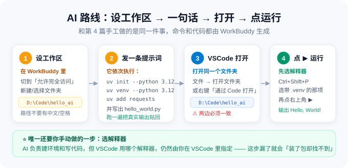

# 第 5 篇：用 WorkBuddy 配好工作区，在 VSCode 里打开并运行

> **一句话结论**
> 这一篇走「**AI 路线**」：**在 WorkBuddy 里设置工作区 → 一条提示词让它建好 uv 环境并写好 hello_world.py → 在 VSCode 里打开这个工作区 → 点 ▶ 运行**。
> 和第 4 篇做的**完全是同一件事**，区别是：命令不用你敲，代码不用你写。
> **走完这一篇，本套教程的环境部分就全部通关了。**



---

## 一、先把「工作区」这个词说清楚

| 概念 | 是什么 | 在谁里面 |
| :--- | :--- | :--- |
| **文件夹** | 磁盘上的一个目录 | Windows 资源管理器 |
| **工作区（Workspace）** | 被某个工具「当作当前项目根目录」打开的那个文件夹 | VSCode / WorkBuddy |
| **本项目的工作区** | 就是你的项目文件夹，例如 `D:\Code\hello_ai` | 两者都要设成同一个 |

**关键点**：WorkBuddy 和 VSCode 要**指向同一个文件夹**。
WorkBuddy 在里面生成文件 → VSCode 打开同一个文件夹 → 立刻就能看到、就能运行。

> ⚠️ 两边路径不一致是最常见的翻车点。建议**干脆用同一个路径**，比如都用 `D:\Code\hello_ai`。

---

## 二、⭐ 第 1 步：在 WorkBuddy 里设置工作区

```
① 打开 WorkBuddy 客户端
      ↓
② 新建任务，把权限切到【允许完全访问】
   （只有该模式能读写文件、执行终端命令）
      ↓
③ 找到「工作目录 / 工作区」入口，选择或新建文件夹
   · 建议新建一个空文件夹，例如：D:\Code\hello_ai
   · 路径里不要出现中文和空格
      ↓
④ 确认顶部/输入框附近显示的当前工作区路径无误
```

> 💡 **找不到工作区入口？** 直接在对话里说：
> `请把 D:\Code\hello_ai 设为当前工作目录`，它会切过去并把后续操作限定在该目录内。

**为什么要先设工作区**：设了之后，WorkBuddy 创建的文件都在这个文件夹里，
**不会散落到别的地方**，你才能在 VSCode 里一次打开就看到全部成果。

---

## 三、⭐ 第 2 步：一条提示词，让它建环境 + 写代码

把下面**整个代码块**复制进去，发送：

````text
# 任务：在工作区里搭好 Python 项目并写一个 hello_world.py

## 基本信息
- 工作目录：当前工作区（D:\Code\hello_ai）
- Python 版本：3.12（用 uv 管理，已装好 uv 和 Python 3.12）
- Shell：PowerShell

## 你要做的事
1. 确认当前工作目录路径，确认 uv 和 Python 3.12 可用（uv --version、uv python list --only-installed）。
2. 用 uv 初始化项目：uv init --python 3.12
3. 创建虚拟环境：uv venv --python 3.12
4. 安装依赖：uv add requests
5. 创建 hello_world.py，内容要求：
   - 有一个 main() 函数，带类型注解 -> None
   - 打印 "Hello, World!"
   - 打印当前 Python 版本（sys.version.split()[0]）
   - 打印当前解释器路径（sys.executable）
   - 打印 requests 的版本号，验证依赖确实装进了这个环境
   - 用 if __name__ == "__main__": 调用 main()
6. 用 uv run hello_world.py 实际运行一次，把真实输出贴给我。
7. 创建 .gitignore，排除 .venv/、__pycache__/、*.pyc（这些不该提交 Git）。

## 约束
- 所有操作都限定在当前工作区内，不要在其他目录创建文件。
- 不要修改系统级环境变量。
- 每一步都要贴出你实际执行的命令和真实输出，禁止编造。
- 最后用表格给我一份交付清单：
  | 文件/目录 | 作用 |
  并告诉我「在 VSCode 里应该打开哪个文件夹」。
````

### 3.1 你会看到它依次做完这些

```
① 确认工作目录 + uv / Python 可用
         ↓
② uv init --python 3.12        → 生成 pyproject.toml、.python-version
         ↓
③ uv venv --python 3.12        → 生成 .venv
         ↓
④ uv add requests              → 写入依赖并锁定 uv.lock
         ↓
⑤ 创建 hello_world.py
         ↓
⑥ uv run hello_world.py        → 贴出真实运行结果
         ↓
⑦ 创建 .gitignore（排除 .venv/、__pycache__/、*.pyc）
         ↓
⑧ 输出交付清单表格 + 「该打开哪个文件夹」
```

### 3.2 跑完之后，工作区里应该有这些

```
hello_ai/
├── .venv/              ← 虚拟环境
├── .python-version     ← 固定 3.12
├── pyproject.toml      ← 项目配置与依赖清单
├── uv.lock             ← 依赖锁文件
├── .gitignore          ← 排除 .venv/、__pycache__/（不提交 Git）
├── hello_world.py      ← ⭐ 它写的代码
└── README.md
```

**打开它写的 `hello_world.py` 看一眼**——对照第 4 篇你自己写的版本，
你会发现结构几乎一样（这正说明「AI 干的活」和「你手工干的活」是同一件事）。

---

## 四、第 3 步：在 VSCode 里打开这个工作区

```
方式一：VSCode 里「文件」→「打开文件夹」→ 选中 D:\Code\hello_ai
方式二：资源管理器里右键该文件夹 → 「通过 Code 打开」
方式三：终端里 cd 到该目录，敲：code .
```

> ⚠️ 同样是**打开文件夹**，不是打开单个文件。

打开后确认左侧资源管理器里能看到 `hello_world.py`、`.venv`、`pyproject.toml`。

---

## 五、第 4 步：确认解释器，点 ▶ 运行

### 5.1 确认解释器（AI 建的环境同样要选一次）

```
① Ctrl + Shift + P → Python: 选择解释器
      ↓
② 选带【.venv】的那一项：
   Python 3.12.x ('.venv': venv)  .\.venv\Scripts\python.exe
      ↓
③ 确认 VSCode 右下角显示的路径里包含 .venv
```

> ⚠️ **别忘了这一步。** AI 负责建环境，**选哪个解释器仍然是 VSCode 自己的决定**。

### 5.2 点右上角 ▶ 运行

打开 `hello_world.py`，点编辑器**右上角**的 ▶ **运行 Python 文件**按钮。

期望输出：

```text
Hello, World!
当前 Python 版本：3.12.x
解释器路径：D:\Code\hello_ai\.venv\Scripts\python.exe
requests 版本：2.xx.x
```

> ✅ **第三行带 `.venv`、第四行能打印出版本号** = 环境、代码、依赖三者全通。

也可以在集成终端里跑（<kbd>Ctrl</kbd> + <kbd>`</kbd> 打开）：

```powershell
uv run hello_world.py
```

---

## 六、两条路线对比：第 4 篇 vs 第 5 篇

| 环节 | 第 4 篇（手动） | 第 5 篇（AI） |
| :--- | :--- | :--- |
| 打开文件夹 | 你在 VSCode 里操作 | 你在 WorkBuddy 里设工作区 |
| 初始化项目 | 你敲 `uv init` | 一句话 |
| 建虚拟环境 | 你敲 `uv venv` | 一句话 |
| 装依赖 | 你敲 `uv add requests` | 一句话 |
| 写代码 | 你手打 | 一句话 |
| 运行验证 | 你点 ▶ | 它先跑一遍，你再点 ▶ |
| 选解释器 | **你要做** | **你仍然要做**（VSCode 的事） |
| 出错排查 | 自己搜 | 把报错粘回去让它修 |

> 🔑 **真正的差别在哪？** 不在于省了几条命令，而在于：
> **你可以用「说人话」描述目标，而不用记住命令的拼写和参数顺序。**
> 当你想做更复杂的东西时，这个差别会被放大几十倍。
>
> ⚠️ 但**基础操作要懂**——所以本教程让你第 4 篇先手动走一遍。
> 懂原理才能判断 AI 做对了没有，也才能在它卡住时指出问题。

---

## 七、继续加需求：让 AI 迭代

环境通了，就可以让它接着干活了。**直接追加需求即可**，例如：

| 你想加什么 | 直接这么说 |
| :--- | :--- |
| 加个函数 | `在 hello_world.py 里加一个 add(a: int, b: int) -> int 函数，并在 main 里打印 add(2, 3) 的结果` |
| 加单元测试 | `用 pytest 给 add 函数写单元测试，放到 tests/test_hello.py，并跑一遍给我看结果` |
| 装新依赖 | `装上 rich，把输出改成带颜色的表格` |
| 生成 requirements.txt | `导出一份 requirements.txt` |
| 代码检查与格式化 | `装上 ruff，检查整个项目并自动修复能修的问题` |

> 💡 **每次让它改完，回到 VSCode 点一下 ▶ 验证**。
> 「AI 写完 → 你自己跑一遍确认」这个循环，是和 AI 协作最稳妥的节奏。

---

## 八、全流程总验收

从第 1 篇到现在，逐项对照。**全绿 = 环境彻底配好了。**

**A 段：软件安装（[第 1 篇](01-VSCode与WorkBuddy安装与汉化.md)）**

| # | 检查项 | 通过标准 |
| :---: | :--- | :--- |
| 1 | VSCode 已安装 | 能打开，看到欢迎页 |
| 2 | 界面是中文 | 菜单栏显示「文件 / 编辑 / 查看」 |
| 3 | WorkBuddy 已安装并登录 | 能进入对话界面 |
| 4 | 免费积分已领 | 头像 → 个人中心能看到余额 |

**B 段：系统环境（[第 3 篇](03-用WorkBuddy安装uv与Python3.12.md)）**

| # | 检查项 | 通过标准 |
| :---: | :--- | :--- |
| 5 | uv 已安装 | `uv --version` 输出版本号 |
| 6 | 环境变量生效 | `UV_PYTHON_INSTALL_DIR` 返回设定路径 |
| 7 | Python 3.12 已安装 | `uv python list --only-installed` 列出 3.12.x |

**C 段：项目与运行（第 4、5 篇）**

| # | 检查项 | 通过标准 |
| :---: | :--- | :--- |
| 8 | Python 扩展已装 | 扩展面板显示「已安装」 |
| 9 | 手动配过一次环境（第 4 篇） | `D:\Code\demo` 能跑通 |
| 10 | AI 配过一次环境（第 5 篇） | `D:\Code\hello_ai` 能跑通 |
| 11 | **解释器选对** | 右下角路径含 `.venv` |
| 12 | 依赖可用 | 能打印出 requests 版本号 |
| 13 | 点 ▶ 能运行 | 终端输出 `Hello, World!` |
| 14 | 断点能停住 | F5 后程序在红点处暂停 |

---

## 九、常见问题

**Q1：WorkBuddy 把文件建到别的地方去了？**
说明工作区没设对，或提示词里没强调「限定在当前工作区」。
让它执行 `pwd`（PowerShell）确认当前目录；不对就明确说「切换到 `D:\Code\hello_ai` 再继续」。

**Q2：VSCode 里打开文件夹，看不到 AI 创建的文件？**
九成是**两边路径不一致**。回到 WorkBuddy 问一句「你刚才是在哪个目录创建的文件」，
拿到真实路径后再在 VSCode 里打开那个文件夹。

**Q3：点 ▶ 报 `ModuleNotFoundError: No module named 'requests'`，但 AI 说装好了？**
解释器没选对。按 5.1 重选 `.venv` 里的解释器。
注意：**AI 装依赖是装进 `.venv` 的，VSCode 必须也用这个 `.venv` 才找得到。**

**Q4：AI 写的 hello_world.py 和我第 4 篇写的不一样，正常吗？**
正常。实现细节不影响结果，只要**能跑、输出符合要求**就行。

**Q5：它跑出来的版本号和我的不一样？**
正常。Python 3.12.x 的补丁号、requests 的版本号本来就会随时间变化。

**Q6：可以让它直接帮我写更复杂的项目吗？**
可以，这正是下一步。见下面的「下一步」。

---

## 十、下一步：做一个真实的项目

环境已经通关。如果你想继续练手，去 **[传感器监控平台](../传感器监控平台/README.md)**——
从读三个 RS485 传感器的厂商接口文档开始，一路做到一个能实时看数据、能控设备的网页，
全程 6 篇、11 段提示词，**用的就是你在这一篇学会的「设工作区 → 说需求 → 打开验证」这套流程**。

---

⬅️ 上一篇：[第 4 篇 · 在 VSCode 里配环境并跑通 Hello World](04-VSCode终端配置环境与HelloWorld.md)　|　🏠 返回 [总导读](../README.md)　|　➡️ 继续实战：[传感器监控平台](../传感器监控平台/README.md)
