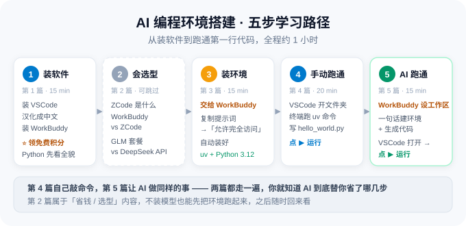

# 教学文档 · 总导读

> 这里有两套互相独立的教学文档：
> **「[AI 编程环境搭建](#ai-编程环境搭建5-篇)」**——从装工具到跑通第一行 Python，共 5 篇；
> **「[传感器监控平台](#传感器监控平台6-篇)」**——从读 RS485 接口文档到做出实时监控网页，共 6 篇。
> 目标读者：**零基础 / 刚换电脑 / 想用 AI 把想法真正做出来的人**。
>
> 📖 **第一次打开 `.md` 文件？** 先花 2 分钟看 →
> **Markdown 文档查看帮助**（见本地文档包）（也附了 PDF：`Markdown文档查看帮助.pdf`）
>
> 🎨 **用 VSCode 打开整个文件夹**，预览会自动套上本仓库自带的配色与高亮方案
> （提示词块会高亮成琥珀色卡片），无需任何设置。详见查看帮助（见本地文档包「Markdown文档查看帮助」）
>
> 文档更新日期：**2026 年 9 月 16 日**

---

## 一、这篇文档解决什么问题

新手常见的三类卡点：

1. **不知道该装哪个** —— VSCode、WorkBuddy、ZCode 都是什么？区别在哪？装哪个？
2. **不知道模型怎么买** —— GLM 套餐和 DeepSeek API 哪个划算？钱花在哪儿？
3. **环境配不起来** —— Python 装不上、uv 不认识、VSCode 里跑的版本不对……

「AI 编程环境搭建」这 5 篇按**装软件 → 会选型 → 装环境 → 手动跑通 → AI 跑通**的顺序，
把这三类卡点一次说清。

---

## 二、文档清单

本目录下有两套独立的教学文档，各自放在一个子文件夹里，互不依赖，按需选读。

<a id="ai-编程环境搭建5-篇"></a>

### 【文件夹】AI 编程环境搭建（5 篇）

| # | 文档 | 你会得到什么 | 建议用时 |
| :---: | :--- | :--- | :---: |
| **1** | [装好 VSCode 与 WorkBuddy，并汉化成中文](/2026/09/16/AI学习/AI编程环境搭建/01-VSCode与WorkBuddy安装与汉化/) | VSCode 装好、界面变中文、WorkBuddy 能登录、**免费积分全部领到手** | 15 min |
| **2** | [认识 ZCode，搞清工具与模型怎么选](/2026/09/16/AI学习/AI编程环境搭建/02-ZCode与WorkBuddy对比及模型选型/) | WorkBuddy vs ZCode、GLM 套餐 vs DeepSeek API；**接 DeepSeek API 为可选进阶（需充值，可跳过）** | 15 min |
| **3** | [用 WorkBuddy 装好 uv 和 Python 3.12](/2026/09/16/AI学习/AI编程环境搭建/03-用WorkBuddy安装uv与Python3.12/) | 搞清 **uv 是什么、强在哪**，再用一份**可复制的提示词**让 AI 装好 uv + Python（**只装系统环境**） | 15 min |
| **4** | [在 VSCode 里配环境，跑通 Hello World](/2026/09/16/AI学习/AI编程环境搭建/04-VSCode终端配置环境与HelloWorld/) | 打开文件夹 → 开终端 → uv 建环境 → 写 `hello_world.py` → **点 ▶ 运行**（手动路线） | 20 min |
| **5** | [用 WorkBuddy 配好工作区并运行代码](/2026/09/16/AI学习/AI编程环境搭建/05-用WorkBuddy配置工作区并运行代码/) | 设工作区 → 一句话让 AI 建环境写代码 → VSCode 打开 → 点运行（**AI 路线**） | 15 min |

**合计约 1 小时 20 分钟**。第 4、5 篇做的是**同一件事**，一个手动一个交给 AI，
**建议两篇都走一遍**——对比之下你才清楚 AI 到底替你省了哪几步。

<a id="传感器监控平台6-篇"></a>

### 【文件夹】传感器监控平台（6 篇）

从「读三个 RS485 传感器的寄存器」到「一个能实时看数据、能控设备的网页」，全程配提示词。

> ⚙️ **这一套不直接给寄存器表**——协议事实由你**指挥 AI 读取厂商接口文档**总结出来。
> 三份接口文档原件放在 `传感器监控平台/通讯协议文档/`。

| # | 文档 | 你会得到什么 | 提示词 |
| :---: | :--- | :--- | :---: |
| — | [**传感器监控平台 · 导读**](/2026/09/16/AI学习/传感器监控平台/README/) | 硬件清单、**485 集线器拓扑**、接口文档清单、**协议摘要参考答案（验收用）** | — |
| **1** | [环境搭建与项目骨架](/2026/09/16/AI学习/传感器监控平台/01-环境搭建与项目骨架/) | uv + Python 3.12 + pymodbus / FastAPI 全套依赖 + 规范目录 | 1 段 |
| **2** | [串口链路打通与本地模拟器](/2026/09/16/AI学习/传感器监控平台/02-串口链路打通与模拟器/) | **让 AI 读接口文档产出协议摘要** + 串口工具 + 免硬件的本地模拟器 | 2 段 |
| **3** | [真机接入与总线组网](/2026/09/16/AI学习/传感器监控平台/03-真机接入与总线组网/) | **RS485 总线原理 + 逐台改从机地址 + 统一波特率 + 485 集线器组网与总线联调** | 3 段 |
| **4** | [三个传感器驱动开发](/2026/09/16/AI学习/传感器监控平台/04-三个传感器驱动开发/) | 统一基类 + 三个驱动类 + 三个调试脚本（**核心**） | 2 段 |
| **5** | [实时采集与控制后端](/2026/09/16/AI学习/传感器监控平台/05-实时采集与控制后端/) | FastAPI 轮询采集 + 缓存 + WebSocket 推送 + 控制接口 | 1 段 |
| **6** | [前端网页与联调测试](/2026/09/16/AI学习/传感器监控平台/06-前端网页与联调测试/) | 单文件网页 + pytest 自动化测试 + 真机整机验收清单 | 2 段 |

**合计约 2 小时 40 分钟**（含接线与联调），共 **11 段提示词**。

---

## 三、推荐阅读路径

### AI 编程环境搭建：五步走



```
第 1 篇：装 VSCode → 汉化 → 装 WorkBuddy → 领积分（15 分钟，立刻能干活）
   ↓
第 2 篇：认识 ZCode、搞清工具与模型怎么选（可跳过，之后回来读）
   ↓
第 3 篇：复制提示词给 WorkBuddy，让它自动装好 uv + Python 3.12
   ↓
第 4 篇：在 VSCode 里开文件夹 → 终端配环境 → 写 hello_world.py → 点 ▶ 运行
   ↓
第 5 篇：让 WorkBuddy 建工作区 → 一句话生成环境和代码 → VSCode 打开 → 点 ▶ 运行
```

### 传感器监控平台：最短路径

```
第 2 篇：让 AI 读三份接口文档 → 产出协议摘要 → 你核对（其余都建立在这上面）
   ↓
第 2 篇后半：跑通串口 + 起本地模拟器（不接真硬件也能验证）
   ↓
第 3 篇：逐台改从机地址、统一波特率 → 接上 485 集线器 → 总线整体验收
   ↓
第 4 篇：写三个传感器驱动，逐个跑调试脚本（本篇是核心）
   ↓
第 5 → 6 篇：包成后端 + 网页，浏览器里就能看数据、按按钮
```

[第 1 篇](/2026/09/16/AI学习/传感器监控平台/01-环境搭建与项目骨架/) 是前置环境；
[第 3 篇](/2026/09/16/AI学习/传感器监控平台/03-真机接入与总线组网/) 是**真机环节的分水岭**——
不接硬件时用它了解总线机制，接了硬件就必须先过它这一关；
[第 6 篇](/2026/09/16/AI学习/传感器监控平台/06-前端网页与联调测试/) 末尾有整机验收清单。

---

## 四、开跑前你需要知道的三件事

**1）当前最值钱的一条信息**

> GLM Coding Plan 的「夜间畅用活动」：**2026 年 9 月 3 日 – 9 月 20 日**
> （**需 GLM Coding Plan 付费套餐用户**），每晚 **23:00 至次日 09:00**，
> 在 **ZCode** 中调用 **GLM-5.3-Flash**，**额度消耗为 0（免费畅用）**。
> 详见 → [第 2 篇 · 3.1(3) 夜间畅用活动](AI编程环境搭建/02-ZCode与WorkBuddy对比及模型选型.md#sec-glm-night)

**2）WorkBuddy 的免费积分，登录后请立刻领**

新人礼包 + 每月固定 + 每日签到 + 成长计划，四条路加起来是**一大笔可用的免费额度**。
第 3、5 篇都要消耗积分，**先领再干活**。
**把积分领全后，不充值也能完成两套教程的全部练习**；第 2 篇的 DeepSeek API 接入是可选进阶（需充值），跳过不影响后续。
详见 → [第 1 篇 · 4.3 免费积分怎么领](AI编程环境搭建/01-VSCode与WorkBuddy安装与汉化.md#sec-wb-points)

**3）价格和活动都有时效性**

文中价格、活动时间均标注了**采集日期**。下单前请务必回到**官方页面**再确认一次：

| 需要确认什么 | 去哪儿看 |
| :--- | :--- |
| WorkBuddy 下载与积分规则 | <https://www.codebuddy.cn/work> |
| ZCode 下载与版本 | <https://zcode.z.ai/cn> |
| GLM Coding Plan 价格与活动 | <https://docs.z.ai/devpack/overview> |
| 夜间畅用活动条款 | <https://docs.bigmodel.cn/cn/coding-plan/notice/event-glm-5.3-flash> |
| DeepSeek API 价格 | <https://api-docs.deepseek.com/zh-cn/quick_start/pricing/> |

---

## 五、文件结构

```
教学文档/                                     ← 整个文件夹拷走即可，内部全是相对路径
├── README.md                                 ← 总导读（你正在看的这篇）
├── Markdown文档查看帮助.md / .pdf              ← 怎么打开 .md、怎么看配图、常见问题
│
├── .vscode/                                  ← VSCode 工作区配置（只影响本文件夹，可删）
│   ├── settings.json                         ← 预览字体排版、配色、语法高亮规则
│   ├── markdown-preview.css                  ← 预览样式表（改主色改这里）
│   └── extensions.json                       ← 建议安装的扩展
│
├── AI编程环境搭建/                             ← 装工具、配环境、跑通第一行代码
│   ├── 01-VSCode与WorkBuddy安装与汉化.md        装 VSCode + 汉化 + 装 WorkBuddy + 领积分
│   ├── 02-ZCode与WorkBuddy对比及模型选型.md      ZCode 介绍 + 两工具对比 + 两套模型对比
│   ├── 03-用WorkBuddy安装uv与Python3.12.md      一条提示词让 AI 装好 uv 与 Python
│   ├── 04-VSCode终端配置环境与HelloWorld.md      手动路线：开文件夹→终端→点 ▶ 运行
│   ├── 05-用WorkBuddy配置工作区并运行代码.md     AI 路线：设工作区→生成→VSCode 打开运行
│   └── images/                               ← 本套配图（SVG 矢量图，12 张）
│       ├── 00-roadmap.svg              五步学习路径
│       ├── 01-install-overview.svg     第 1 篇三件套总览
│       ├── 01-points.svg               WorkBuddy 免费积分四条路
│       ├── 01-cover.svg                WorkBuddy 与 ZCode 定位对比
│       ├── 02-cost.svg                 订阅制 vs 按量计费成本趋势
│       ├── 02-night.svg                夜间畅用活动时间轴
│       ├── 02-addapi.svg               客户端接入 DeepSeek API 三步
│       ├── 03-what-is-uv.svg           uv 是什么：一个工具管三件事
│       ├── 03-uv-flow.svg              uv 环境搭建四步
│       ├── 04-vscode-steps.svg         VSCode 配置四步
│       ├── 04-hello-flow.svg           终端期望输出示意
│       └── 05-workspace-flow.svg       工作区四步（AI 路线）
│
└── 传感器监控平台/                             ← 用 AI 做一个真实的采集控制项目
    ├── README.md                             ← 该套的导读（含协议摘要参考答案）
    ├── 01-环境搭建与项目骨架.md
    ├── 02-串口链路打通与模拟器.md
    ├── 03-真机接入与总线组网.md                ← 改地址 / 统一波特率 / 485 集线器
    ├── 04-三个传感器驱动开发.md
    ├── 05-实时采集与控制后端.md
    ├── 06-前端网页与联调测试.md
    ├── images/                               ← 该套的配图（10 张）
    │   ├── 00-architecture.svg   系统架构五层
    │   ├── 00-roadmap.svg        六步学习路径
    │   ├── 02-debug-flow.svg     链路自检三步法
    │   ├── 03-rs485-bus.svg      RS485 一主多从点名机制
    │   ├── 03-topology.svg       485 集线器组网与参数规划
    │   ├── 03-protocol-flow.svg  从接口文档到驱动代码（四步走）
    │   ├── 03-registers.svg      寄存器速查（验收参考答案用）
    │   ├── 04-dataflow.svg       采集与控制时序
    │   ├── 05-ui-mock.svg        网页界面线框
    │   └── 06-run-button.svg     VSCode ▶ 运行按钮示意
    └── 通讯协议文档/                          ← 三份厂商原始接口文档（未改动）
        ├── JXBS-3001-GZ 485型光照度变送器V1.0.doc
        ├── 声光报警器  RS485 ModBus_RTU 通讯协议V2.3.pdf
        └── 超声波传感器DYP-RD-产品规格书(DYP-A22-V1.0)-230522-A0（雷达）.pdf
```

> 🧭 **两套文档的关系**：从本页 [第二节](#二文档清单) 可以进入任一套的任一篇；
> 每一篇底部都有「返回导读 / 返回总导读」的链接。
> **传感器监控平台是自包含的**——6 个 md + 配图 + 随附接口文档，可以单独打包交给别人，**不依赖本页**。

> 🤖 **传感器监控平台为什么不给寄存器表**：真实工作里你手上只有厂商说明书，
> 「让 AI 把文档读成工程规格，再由你核对」本身就是核心技能。
> 具体做法见 [该套导读](/2026/09/16/AI学习/传感器监控平台/README/)；答案只在导读末尾的**附录 A**里。

> 💡 配图是 `.svg` 矢量格式。用 Typora / VSCode 预览 / GitHub 打开都能正常显示；
> 导出 PDF 或打印也**不会糊**。

> 📄 **关于 PDF**：本目录只保留一份 PDF——`Markdown文档查看帮助.pdf`（给不想装任何软件的人看）。
> 两套正文都是 `.md`，**刻意不发 PDF**：它们是要动手做的，
> md 方便你边改边把整段提示词复制给 AI。

---

## 六、环境要求速查

| 项目 | 要求 |
| :--- | :--- |
| 操作系统 | Windows 10 / 11（**Windows 7 及以下不支持 WorkBuddy**）；也覆盖 macOS 12.0+ |
| 磁盘 | 建议预留 5 GB 以上；uv 相关文件可放到非系统盘 |
| 网络 | 需要能访问扩展市场与模型接口；国内网络访问扩展市场偶尔偏慢，重试即可 |
| 权限 | 安装软件需要管理员权限；环境变量配置只用**用户级**即可，不需要管理员 |

---

## 七、文档约定

- 代码块里的命令**可以直接复制**到 PowerShell 执行。
- 标注 `⚠️` 的是**容易踩的坑**，建议重点看。
- 标注 `⭐` 的是**本文档的核心内容 / 当前最划算的信息**。
- 用 ```` ```text ```` 标记的代码块是**提示词**，整段复制给 AI 智能体即可。
- 所有价格、活动页面均附官方来源链接，**以官方口径为准**。

---

**开始阅读** → [第 1 篇 · 装好 VSCode 与 WorkBuddy](/2026/09/16/AI学习/AI编程环境搭建/01-VSCode与WorkBuddy安装与汉化/)
　|　**想直接做项目** → [传感器监控平台](/2026/09/16/AI学习/传感器监控平台/README/)
　|　**不知道怎么打开 md** → Markdown 文档查看帮助（见本地文档包）
