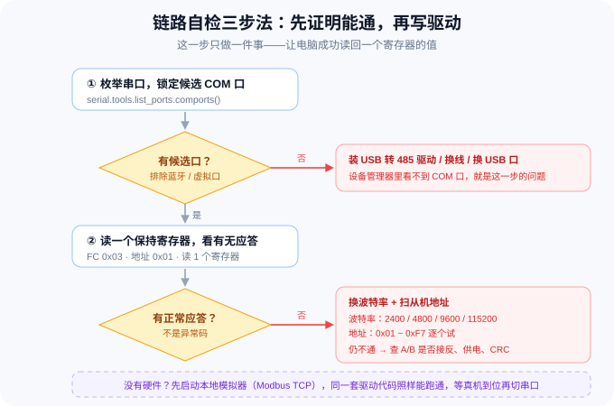

# 第 2 篇：串口链路打通与本地模拟器

> **本篇目标**
> 在做任何业务之前，先用三个小工具回答一个问题：**电脑到底能不能和传感器说上话？**
> 同时搭一个**本地 Modbus 模拟器**——没有硬件的时候，后面所有代码照样能开发、能测试。
>
> 预计 **20 分钟**。

---

## 一、为什么这一步不能跳

新手最常见的失败路径是这样的：

```
接线 → 直接开写业务代码 → 跑起来报错 → 不知道是接线错、波特率错、地址错还是代码错
→ 一个个试 → 三小时后放弃了
```

**正确做法是先做减法**：把「通讯是否通」和「代码是否正确」这两件事**分开验证**。

- 先用**通用工具**（不含任何业务逻辑）确认链路 → 通了，说明接线、波特率、地址全对
- 再写业务驱动 → 一旦报错，**一定是代码问题**，排查范围瞬间缩小



---

## 〇、30 秒搞懂 Modbus（本篇要用到的最少知识）

- **一主多从**：电脑是「主机」，主动点名；传感器是「从机」，各自占一个 **1~247 的从机地址**（总线原理第 3 篇细讲）。
- **数据放在「寄存器」里**：每个寄存器是一个 16 位的格子（值 0~65535），按地址编号（如 `0x0007`）。
  读传感器数据、下控制命令，本质上都是**读 / 写这些格子**。
- **功能码**：请求帧里注明这次要干什么——`0x03` 读寄存器、`0x06` 写单个寄存器、`0x10` 写多个寄存器。
- **CRC 校验**：每帧末尾带两字节校验码；接线反了、波特率不对，最先表现出来的就是 CRC 错或超时。

本篇要做的三个工具，就是围绕这几件事：**找串口 → 扫地址 → 读写寄存器**。

---

## 二、⭐ 提示词 A：三个通用调试工具

> 打开 WorkBuddy → **「允许完全访问」** → 新建任务 → 整段复制。

````text
# 任务：为 RS485 传感器项目开发三个通用 Modbus 调试工具

## 背景
项目根目录 = **当前工作目录下的 `sensor-hub` 子目录**。开工前先 `Get-Location` 确认；
如果我在这段对话里另行指定了路径，以我指定的为准；
**不要写死盘符或用户名路径**，并在你输出的第一行先报告实际使用的绝对路径。
环境已就绪：uv 管理依赖，已安装 pymodbus 3.x（串口 + TCP 均支持）、pyserial。
项目已用 `uv add` 装好依赖，`app/`、`tools/`、`tests/` 目录已存在。

本任务只写 tools/ 下的三个命令行工具，**不写任何传感器业务逻辑**。

## 通用要求
1. 全部用 argparse 提供命令行参数，中文帮助信息。
2. 必须在项目根目录下用 `uv run python -m tools.xxx` 或 `uv run python tools/xxx.py` 能跑通。
3. **先实测 pymodbus 的 API**：运行
   `uv run python -c "import pymodbus,inspect;print(pymodbus.__version__);from pymodbus.client import ModbusSerialClient as C;print(inspect.signature(C.read_holding_registers));print(inspect.signature(C.__init__))"`
   按输出结果决定从机地址参数名（device_id / slave / unit）写代码，不要照抄网上文章。
4. 所有工具都要有超时保护，绝对不能无限阻塞；失败要有清晰的错误信息。
5. 代码里不要出现任何硬编码的 COM 口，全部走命令行参数。

## 工具 1：tools/scan_ports.py —— 枚举串口
功能：
- 用 serial.tools.list_ports.comports() 列出本机所有串口
- 对每个口输出：端口名、描述、硬件 ID、VID:PID、制造商
- 自动标记「可疑的虚拟/蓝牙串口」（描述里含 Bluetooth / BTHENUM / 虚拟 / Virtual 的），单列出来提示用户排除
- 支持 `--only-usb` 只显示看起来像 USB 转串口的（VID/PID 存在或描述含 USB/CH34/CP21/FT23/PL2303/Silicon）
输出示例格式：
  可用串口：
    COM3   USB-SERIAL CH340 (COM3)   VID:PID=1A86:7523
  疑似非目标设备（已排除）：
    COM5   标准蓝牙链接上的标准串行 (COM5)

## 工具 2：tools/scan_slaves.py —— 扫描从机地址
参数：--port（必填）、--baud（默认 9600）、--parity（默认 N）、--timeout（默认 0.3）、
      --start（默认 1）、--end（默认 247）、--baud-scan（可选，给了就依次试 2400/4800/9600/115200）
功能：
- 对指定串口，逐个从机地址发送「读保持寄存器」请求（功能码 0x03，读 1 个寄存器，起始地址 0x0000）
- 有正常应答则记录并打印该地址
- 区分三种情况并分别统计：
  · 正常应答（打印地址 + 返回的寄存器值）
  · 异常应答（Modbus 异常码，说明设备在但请求有问题，也要打印出来并显示异常码）
  · 超时无响应
- 扫描过程要有进度提示，但不要每个地址都刷屏
- 结束时打印汇总：扫描范围、耗时、找到的从机地址列表
- 若 --baud-scan 指定，则对每个波特率各扫一遍，最后给出「哪个波特率找到了设备」的结论

## 工具 3：tools/regtool.py —— 通用寄存器读写
参数：
  --port / --baud / --parity / --timeout   串口参数
  --host / --tcp-port                     如果给了 host 则走 Modbus TCP（无硬件时连本地模拟器）
  --slave（默认 1）                        从机地址
  --fc（默认 3）                           功能码：3=读保持寄存器，6=写单个寄存器，16=写多个寄存器
  --addr                                   寄存器地址，支持 0x 前缀十六进制
  --count（默认 1）                        读多少个
  --write                                  写入值，支持多个（空格分隔），配合 fc=6 或 16
功能：
- 读：打印每个寄存器的「十六进制 / 十进制」两列，并附上原始应答帧（hex）
- 写：打印请求值和是否成功；fc=6 写单个，fc=16 写连续多个
- 支持 `--json` 输出机器可读结果，方便脚本调用
- 出错时打印 Modbus 异常码并给出人话解释：
  01=非法功能码 02=非法寄存器地址 03=非法数据 07=CRC 校验错误
- **写操作之间要有可配置的间隔控制参数 `--gap-ms`**；不同设备对命令最小间隔要求不同，
  具体数值以 `docs/protocol.md` 为准，工具本身不要写死。

## 交付与自测
写完以后：
1. 运行 `uv run python tools/scan_ports.py --only-usb` 并把真实输出贴出来。
2. 运行 `uv run python tools/scan_slaves.py --port COM3` 演示参数解析（哪怕没接硬件、结果是扫不到，也要正常结束不卡死）。
3. 运行 `uv run python tools/regtool.py --help` 贴出帮助信息。
4. 运行 `uv run python tools/regtool.py --host 127.0.0.1 --tcp-port 5020 --slave 1 --addr 0x0000 --count 2`，
   此时模拟器可能还没启动，允许失败，但要给出清晰的「连接失败」提示而不是抛裸异常。
5. 输出自检报告表格：| 工具 | 能否运行 | 是否超时保护 | 备注 |

## 约束
- 不要动 app/ 下的任何文件。
- **全部从零实现**：不要复制粘贴任何既有脚本，也不要让项目 import 它们。
- 三个工具都要写成**通用**的：不要内置任何"某台设备专用"的寄存器地址或换算逻辑
  （寄存器地址后面由 `docs/protocol.md` 提供，本步骤不涉及）。
- 每个工具的默认参数要从 config.yaml 或合理缺省值来，**不带任何参数也要能跑**。
- 检查 `.vscode/launch.json`：**补充启动项前先读取现有内容，「扫描串口」「扫描从机地址」等同名启动项已存在就更新它，不要新增重复项**（全程保持 name 唯一）。
- 每个工具都要能被别的 Python 代码 import 复用（除 CLI 主函数外，核心逻辑写成函数）。
- 真实命令和真实输出，禁止编造。
````

---

## 三、⭐ 提示词 B：先让 AI 读接口文档，再写本地模拟器（免硬件开发）

**这是整套文档里最实用的一步。** 它同时完成两件事：

1. **让智能体自己去读三份厂商接口文档，产出协议摘要 `docs/protocol.md`**——
   这件事**必须由你指挥 AI 去做，文档里不会预先给你寄存器表**。
2. 用这份摘要搭一个本地 Modbus 从机模拟器。有了它你可以：
   - 硬件还没到货就开始写代码
   - 用 pytest 跑**全自动**回归测试（读、写、异常值全覆盖）
   - 演示给别人看，不用抱着传感器到处跑

> ⚠️ **摘要出来之后，请务必自己核对一遍再放行。**
> 模拟器是后面所有测试的「基准」——摘要错，则测试全绿、真机全挂，而且极难查。
> 核对方法：拿摘要里的「原文样例」对答案（对照 [导读 · 附录 A](README.md) 的核对要点）。

````text
# 任务：实现本地 Modbus 从机模拟器，模拟三个 RS485 传感器

## 背景
项目根目录 = **当前工作目录下的 `sensor-hub` 子目录**。开工前先 `Get-Location` 确认；
如果我在这段对话里另行指定了路径，以我指定的为准；
**不要写死盘符或用户名路径**，并在你输出的第一行先报告实际使用的绝对路径。
已安装 pymodbus 3.x。app/simulator.py 目前是空壳。

## 目标
实现一个可独立启动的 Modbus **TCP** 从机服务（默认 127.0.0.1:5020），
在同一个服务里模拟三台设备的寄存器区，用不同从机地址区分：
  · 从机地址 1 → 光照度变送器 JXBS-3001-GZ
  · 从机地址 2 → 超声波 DYP-A22
  · 从机地址 3 → 声光报警器
支持 `--slave-map` 参数自定义映射，默认如上。

## 必须先做的 API 确认
pymodbus 3.x 的服务端 API 在不同小版本差异较大。运行下面的命令确认真实 API 再动手：
uv run python -c "import pymodbus,inspect;print(pymodbus.__version__);import pymodbus.server as s;print([n for n in dir(s) if not n.startswith('_')])"
uv run python -c "from pymodbus.datastore import ModbusServerContext;print(ModbusServerContext)"
必要时查看 `pymodbus.datastore` 下可用的 Context/Device 类名（如 ModbusSlaveContext / ModbusDeviceContext），
按实际存在的类名写代码，并在 README.md 的「开发备注」里记录你用的是哪一套。

## 第 0 步（必做）：读取厂商接口文档，产出协议摘要

**这是本步骤的核心。** 模拟器要「像真设备一样」响应，前提是你知道每台设备的真实寄存器表——
而这个表**必须从厂商接口文档里读出来，不许凭记忆或上网搜索编造**。

### 0.1 先找到接口文档

随附的厂商接口文档共三份：

```
JXBS-3001-GZ 485型光照度变送器V1.0.doc
声光报警器  RS485 ModBus_RTU 通讯协议V2.3.pdf
超声波传感器DYP-RD-产品规格书(DYP-A22-V1.0)-230522-A0（雷达）.pdf
```

在**当前目录、上一级目录、以及名为「通讯协议文档」的子目录**里把它们找出来，
打印每份文件实际所在的绝对路径。**任何一份找不到就停下来问我，不要往下走。**

### 0.2 逐份读取原文

- 三份都是二进制格式（其中 `.doc` 是 Word 97 的 OLE 复合文档），普通文本编辑器打不开，
  要用 Python 解析。可以自行安装 `pymupdf` / `pypdf` / `olefile` 之类的库。
- 提示：`.doc` 的正文在 `WordDocument` 流的文本区（FIB 头部有文本区长度），
  直接用 `gbk` 整篇解码会得到乱码，按 UTF-16LE 按长度截取才干净。
- **必须真的把文件读开**。禁止「根据文件名推测内容」，禁止拿模型记忆里的通用 Modbus 知识
  代替原文。如果某份文档确实解析不出表格，**如实说明**，并把你确实读到的片段贴出来——不要脑补。

### 0.3 产出摘要 `docs/protocol.md`

为每台设备生成一张摘要表，字段至少包含：

| 字段 | 要写清楚什么 |
| :--- | :--- |
| **通讯参数** | 出厂从机地址、出厂波特率、数据位 / 校验位 / 停止位 |
| **功能码** | 支持哪些（读 / 写单个 / 写多个），并写出一条完整的请求帧示例 |
| **寄存器表** | 地址、名称、读写权限、数据类型（uint16 / int16 / uint32 / 位域）、单位、**换算公式**、取值范围、出厂默认值 |
| **特殊值** | 异常值、超量程值、状态码，以及各自的含义 |
| **时序约束** | 命令最小间隔、响应时间等硬性要求 |
| **改参数的方法** | **改从机地址 / 改波特率分别写哪个寄存器、取值范围是多少、是否必须断电重启才生效**，以及文档里有没有"改地址时总线上只能挂一台设备"这类**前提条件** |
| **原文样例** | 文档里给出的**官方读值样例**，保留原始十六进制数 |

写进项目的 `docs/protocol.md`，**并在对话里完整打印一遍**。

### 0.4 停下来等我确认（硬性闸门）

摘要写完后**必须停下来**，把它交给我确认。我确认之后再继续下面的模拟器实现。

> ⚠️ **为什么这一步不能省**：模拟器是你后面所有测试的「基准」。
> 协议摘要要是读错了，模拟器就会按错的寄存器表响应，于是**驱动层的测试全绿、接上真机全挂**——
> 而且这种错极难排查。所以摘要必须由人核对一次：拿 0.3 里的「原文样例」对一遍答案。

## 寄存器实现要求（严格按 `docs/protocol.md`）

动手前重新读一遍 `docs/protocol.md`，然后：

1. 每台设备的寄存器区**按摘要里的地址表建立**——不漏项，也不要自作主张添加文档里没有的寄存器。
2. 数据类型严格按摘要：32 位值跨寄存器时的高低字顺序、有符号数的解码、位域字段的位定义。
3. 出厂默认值取摘要的「出厂默认值」列。
4. 特殊值要**能注入**（见下）。

### 从机 1：光照度变送器

- 按摘要建立寄存器区：只读的测量值 + 可读写的设备地址 / 波特率寄存器。
- 模拟行为：测量值随时间平滑变化（正弦 + 轻微抖动），量级参考摘要里的量程上限；
  可用 `--light-base` 控制基准值。

### 从机 2：超声波测距模组

- 按摘要建立寄存器区：测量区 + 配置区都要有。
- 模拟行为：距离在量程中段随机游走（不要剧烈跳变），温度缓慢漂移。
- **必须支持特殊值注入**：通过参数或内部状态，让距离寄存器输出摘要里标注的
  异常值（同频干扰 / 未检测到物体），用于测试上层对异常值的处理。
- 有符号量（如温度）要能注入**负值**，用来验证上层有没有做符号处理。

### 从机 3：声光报警器

- 按摘要建立寄存器区，支持摘要里列出的**全部功能码**（读 / 写单个 / 写多个）。
- 写入后立即生效并可读回；**写操作要记录日志**（时间、地址、旧值、新值）。
- 位域字段的读回值要能反映单独的位变化（改一位不影响另一位）。

> 📌 三台设备的**寄存器地址、数据类型、量程、默认值、特殊值、位定义，全部以 `docs/protocol.md` 为准**。
> 上面只规定了「模拟行为」——一个寄存器地址或数值都没有给，那些要你自己从文档里读出来。

## 启动方式
支持：
  uv run python -m app.simulator                      # 默认 127.0.0.1:5020，三台设备全开
  uv run python -m app.simulator --host 0.0.0.0 --port 5020
  uv run python -m app.simulator --only ultrasonic    # 只开超声波
  uv run python -m app.simulator --noise              # 开启随机通信异常（可选加分项）
启动后要打印清晰的启动信息：监听地址、注册的从机地址及各代表什么设备、如何停止。
**必须能被 Ctrl+C 干净地终止。**

## 交付与自测（必须实际执行）
1. 后台启动模拟器：`uv run python -m app.simulator`（用 Start-Job 或另开进程，注意不要阻塞）。
   启动后**必须回读确认 5020 端口已在监听**，并提醒用户：这个进程要一直开着，关了后面的读写验证都会「连接失败」。
2. **回填 `config.yaml`**：
   · `slave_id` 按**模拟器的从机映射**填（1 = 光照度 / 2 = 超声波 / 3 = 声光报警器），
     否则驱动去点名时会找错设备；
   · `baudrate` 先按 `docs/protocol.md` 的**出厂值**填（模拟器走 TCP，不校验波特率）；
   · 填完说明你为什么这么填。

   > 这一版是"**能跑通模拟器**"的值。等第 3 篇把真机地址改成互不相同之后，
   > 会再回来把这一段更新成**真机实测值**——所以别担心，现在填的不是最终值。
3. 用 tools/regtool.py 验证读：对**每一台设备**，从 `docs/protocol.md` 里挑一个测量寄存器，
   读回并贴出真实输出（读几个、从哪读，由你根据摘要决定，并说明选择理由）。
4. 用 tools/regtool.py 验证写：对报警器，按摘要挑一个**可写的数值型寄存器**写入一个新值，
   再读回确认已改变；再挑一个**位域寄存器**，只翻转其中一个位，读回确认位变化正确。
   把每次的「写入前 → 写入后」贴出来。
5. 停掉模拟器，确认端口释放。
6. 输出自检报告表格：| 验证项 | 期望 | 实际 | 通过？ |
   表格第一行必须是「协议摘要来源」，写明三份文档的真实路径。

## 约束
- 只写 app/simulator.py、docs/protocol.md，以及必要时的 config.yaml 少量改动。不要动 tools/ 下的已有工具。
- **第 0 步的协议摘要必须先做完、并经我确认，才能开始写模拟器代码。**
- **不要依赖任何真实硬件或串口。**
- **不要在代码里写死寄存器地址**：地址、默认值、特殊值统一从 `docs/protocol.md` 抄成模块级常量
  （或直接写进常量表），并注明「来源：厂商文档 xxx」。
- 模拟器**不带参数就能启动**（默认 127.0.0.1:5020、三台设备全开）；检查 `.vscode/launch.json`——
  「启动本地模拟器」启动项在第 1 篇已存在，**有就更新、不要重复添加**。
- 真实命令和真实输出，禁止编造。失败就如实汇报。
````

---

## 四、手工验证：把工具串起来用

> ▶ **怎么运行**：在 VSCode 里打开 `tools/scan_ports.py` 之类的文件，点编辑器**右上角的 ▶** 就能跑；
> 要带参数（比如指定 COM 口）就点 ▶ 右边的 **▾**，选预配好的启动项。
> 下面列的命令是**等价备选**——不想记命令完全可以不看。详见 [导读 · 第六节](README.md)。

模拟器起来之后，按这个顺序验证一遍：

```powershell
# 1) 看本机有哪些串口（先排除蓝牙和虚拟口）
uv run python tools/scan_ports.py --only-usb

# 2) 有硬件时：扫从机地址（默认波特率，可改）
uv run python tools/scan_slaves.py --port COM3 --baud 9600

# 3) 拿不准波特率时：一次扫全部常用波特率
uv run python tools/scan_slaves.py --port COM3 --baud-scan

# 4) 无硬件时：连模拟器读寄存器（地址从 docs/protocol.md 里抄）
uv run python tools/regtool.py --host 127.0.0.1 --slave 1 --addr <摘要里的测量寄存器地址> --count 2

# 5) 控制类写操作（地址同样来自摘要）
uv run python tools/regtool.py --host 127.0.0.1 --slave 3 --addr <摘要里的可写寄存器地址> --fc 6 --write 15
```

> 💡 **经验**：真机上第一次连不通，**九成是这三件事**——A/B 接反、波特率不对、从机地址不是 1。
> 用 `--baud-scan` 一次就能排除掉后两个。

---

## 五、验证清单

| # | 检查项 | 怎么确认 | 期望 |
| :---: | :--- | :--- | :--- |
| 1 | 能列出串口 | `scan_ports.py` | 打印 COM 列表，蓝牙口被标注 |
| 2 | 扫描工具不卡死 | `scan_slaves.py --port COM3` | 正常结束并给汇总 |
| 3 | 读写工具可复用 | `import tools.regtool` 不报错 | 核心逻辑是函数 |
| 4 | **协议摘要已产出** | 打开 `docs/protocol.md` | 三台设备都有完整的寄存器表与换算公式 |
| 5 | **摘要经人工核对** | 拿文档里的官方样例对答案 | 数值一致（见第六节） |
| 6 | 模拟器能启动 | `-m app.simulator` | 打印监听地址与从机映射 |
| 7 | 模拟器能读 | regtool 读从机 1/2/3 | 返回合理数值 |
| 8 | 模拟器能写 | 写一个数值寄存器再读回 | 值已改变 |
| 9 | 位域读写正确 | 只翻转一个位再读回 | 其他位不受影响 |
| 10 | 特殊值可注入 | 触发摘要里标注的异常值 | 读回该异常值 |
| 11 | Ctrl+C 能退出 | 手动中断 | 端口释放，无残留进程 |
| 12 | `config.yaml` 已回填 | 查看 `devices` 段 | 不再是 `null`，`slave_id` 与模拟器映射一致 |

---

## 六、真机排错速查

| 现象 | 最可能的原因 | 怎么查 |
| :--- | :--- | :--- |
| 设备管理器里看不到 COM 口 | USB 转 485 驱动没装 | 装 CH340 / CP210x / PL2303 对应驱动 |
| 扫不到任何地址（所有波特率都试了） | A/B 接反了 | 把两根通讯线对调再试 |
| 扫到其他地址但没有 1 | 出厂地址被改过 | 用扫出来的地址当 `--slave` |
| 偶尔成功、大多是超时 | 线太长 / 干扰 / 没有终端电阻 | 缩短线、加 120Ω 终端电阻、远离变频器 |
| 返回异常码 02 | 寄存器地址不对 | 核对 `docs/protocol.md` 里该设备的寄存器表 |
| 返回异常码 07 | CRC 错，通常仍是波特率或干扰 | 确认 8N1、无校验 |
| 报警器写进去没反应 | 两条命令间隔太短 | 把 `--gap-ms` 调到 350 以上 |
| 连模拟器报「连接失败 / 连接拒绝」 | 后台模拟器进程被回收或已退出 | 重新运行 `uv run python -m app.simulator`（或 VSCode 点「启动本地模拟器」），看到监听提示后再试 |

---

## 七、参考链接

| 名称 | 链接 |
| :--- | :--- |
| pymodbus 客户端示例 | <https://pymodbus.readthedocs.io/en/latest/source/examples.html> |
| pymodbus 服务端与模拟器 | <https://pymodbus.readthedocs.io/en/latest/source/server.html> |
| pyserial list_ports | <https://pyserial.readthedocs.io/en/latest/tools.html> |
| Modbus 协议速查（功能码与异常码） | <https://modbus.org/specs.php> |

---

⬅️ 上一篇：[第 1 篇 · 环境搭建与项目骨架](01-环境搭建与项目骨架.md)　|　➡️ 下一篇：[第 3 篇 · 真机接入与总线组网](03-真机接入与总线组网.md)
