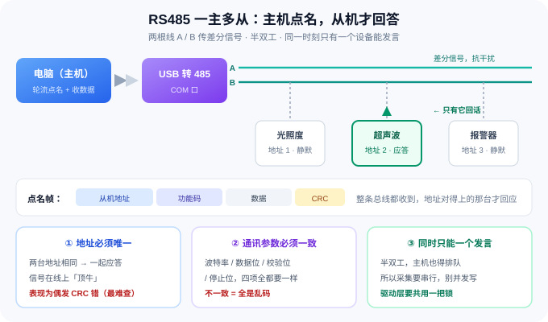
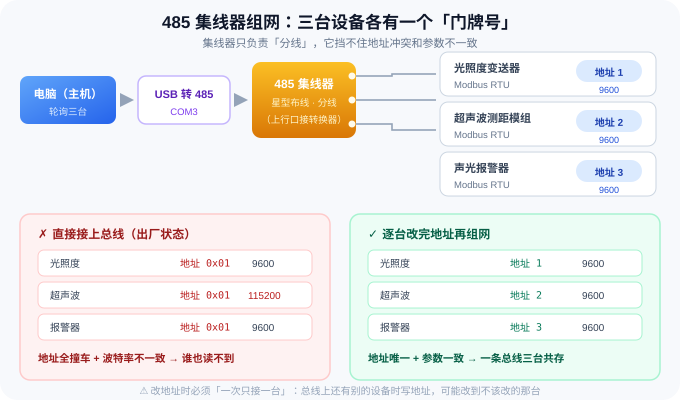

# 第 3 篇：真机接入与总线组网

> **本篇目标**
> 把三台设备从「各自躺在盒子里」变成「挂在一条总线上、互不打架」。
> 三件事：**读懂 RS485 总线怎么工作 → 逐台改地址、统一波特率 → 接上 485 集线器整体调通**。
>
> **人机分工**：只读诊断交给 AI 辅助解读；**改地址 / 改波特率由 AI 一次性生成专用脚本、
> 你在台架前自己执行**——安全联锁固化在代码里，比对话式确认更可靠。
>
> 本篇只让 AI 写一个台架小工具，不碰后面的业务代码；
> 一切寄存器地址一律来自 `docs/protocol.md`。
>
> 📌 **本篇的最终产物**：一个填好的 `config.yaml`（三台设备的真实 `slave_id` / `baudrate`）、
> 一条**能稳定点名的总线**，以及改地址/波特率的专用脚本 `tools/set_identity.py`。
>
> 预计 **40 分钟**（含接线）。

---

## 一、先搞懂 RS485 总线（十分钟，值得花）

### 1.1 三句话理解 RS485

**① 用两根线传差分信号**
RS485 用一对线 **A / B**。接收方看的是 **A 与 B 的电压差**，而不是某根线对地的电压。
好处：环境干扰通常同时加到两根线上，相减之后就抵消了 —— 所以 RS485 能拉到几百米、还能在车间里跑。

**② 半双工**
同一时刻，**总线上只能有一个设备在发言**。发送时收发器把总线"顶住"，别人说话就听不见了。

**③ 一主多从**
**电脑（主机）点名，设备（从机）才回答**。从机之间**不会主动说话**，也**不会互相通知**。
这条决定了整个系统的节奏：必须由主机**轮流点名**。

### 1.2 点名的过程长什么样



主机把一帧发到整条总线上，帧里带着**目标地址**：

```
[ 从机地址 ][ 功能码 ][ 数据 ][ CRC ]
     ↑
   所有设备都会收到，但只有地址对得上的那一台会回应
```

- 地址匹配的设备 → 回一帧数据
- 其余设备 → **安静听着，什么都不做**

于是就有了两条铁律，后面所有麻烦都从这两个地方来：

| 必须 | 为什么 | 违反了会怎样 |
| :--- | :--- | :--- |
| **地址唯一** | 主机靠地址点名 | 两台同时应答 → 信号在线上"顶牛" → 双方都是 CRC 错或乱码 |
| **通讯参数一致** | 收发双方靠同一套时序采样每一个 bit | 完全是乱码，表现得像根本没接上 |

这里的"通讯参数"是四个：**波特率、数据位、校验位、停止位**（俗称 8N1 = 8 数据位 / 无校验 / 1 停止位）。

> ⚠️ **为什么"地址冲突"是最难查的故障**：
> 它不一定每次都出错。两台设备同时应答时，短帧可能只是偶尔 CRC 失败，
> 看起来像"接触不良"或"干扰"——你会去查线、查电源，查半天查不到。
> **所以组网前先把地址规划好，比事后排错省 10 倍时间。**

### 1.3 什么时候要加终端电阻

RS485 是传输线，信号到线尾会**反射**回来。

- 线长 **> 10 m**、设备多、或波特率较高 → **总线两端各加一个 120 Ω 电阻**
- 桌面上几十厘米的短测试线，一般**不用加**

加了可能更稳，加错位置（中间某处、或加三四个）反而会加重负载。**不确定就先不加。**

### 1.4 接线要点（照着做，能省掉一半排错时间）

| 要点 | 说明 |
| :--- | :--- |
| **A 接 A、B 接 B** | 接反了**完全不通**（不会烧设备，但你会以为设备坏了） |
| **共地** | 多台设备务必把 **GND 连到一起**。不共地时可能"有时通有时不通"——最难查的那类故障 |
| **供电别接反** | 这个会烧设备。接线前先断所有电 |
| **远离强电** | 别和变频器、电机线捆在一起走 |
| **屏蔽线单端接地** | 屏蔽层只在一端接地，别两端都接（会形成地环路） |

---

## 二、你的拓扑：485 集线器

本项目三台设备**通过一个 485 集线器**汇集，再由一根线接到电脑：



```
   ┌─────────┐   USB    ┌────────────┐         ┌──────────┐
   │  电脑    │─────────▶│ USB 转 485 │─────────│ 485 集线器 │
   │ (主机)   │          │  转换器     │  A / B  │          │
   └─────────┘          └────────────┘         └─┬──┬──┬──┘
                                                 │  │  └── 报警器   地址 3
                                                 │  └───── 超声波   地址 2
                                                 └──────── 光照度   地址 1
```

**集线器帮你解决什么**

- **星型布线**：不用把线"手拉手"串到底，每条支线独立出线，接线整齐、好维护
- **驱动与隔离**：多数型号每个端口自带隔离与驱动，带更多设备、跑更远更稳
- **扩展**：部分型号能做中继，把总线再延长一段

**它⛔不能解决什么（这点最关键）**

| 集线器救不了 | 原因 |
| :--- | :--- |
| ❌ **地址冲突** | 集线器只是把线分开，主机的点名帧照样广播到所有端口。两台都是 `0x01`，照样一起应答 |
| ❌ **波特率不一致** | 各端口波特率不同，等于三台设备在三套时序里说话 |
| ❌ **A/B 接反** | 物理层的问题，集线器管不了 |

> ✅ **一句话记住**：**集线器让"布线"变简单，但"地址唯一 + 参数一致"这两件事，还是得你自己做。**

---

## 三、地址与波特率规划

三台设备出厂时**从机地址是同一个**、波特率还未必一致。直接挂到一条总线上必然打架。
所以要先给它们重新分配到互不冲突的地址。

| 设备 | 出厂地址 | **计划从机地址** | 出厂波特率 | **计划波特率** |
| :--- | :---: | :---: | :---: | :---: |
| 光照度变送器 | 见 `docs/protocol.md` | **1** | 见 `docs/protocol.md` | **9600** |
| 超声波测距模组 | 同上 | **2** | 同上 | **9600** |
| 声光报警器 | 同上 | **3** | 同上 | **9600** |

> **计划值是我给的项目约定**（也是 `config.yaml` 里要填的值）：地址 1 / 2 / 3，波特率统一 9600。
> **出厂值请从 `docs/protocol.md` 里读**——那是你上一节让 AI 从厂商文档总结出来的，别抄别人的。

**为什么统一到 9600？**

- 三台设备里只有少数支持更高波特率，**迁就最高速的那台**会让整条总线更脆弱；
- 波特率越高，对线长、终端电阻、干扰越敏感；
- 你这里数据量极小（每秒几次读数），**9600 完全够用**，稳定性优先。

> 💡 如果你的线很长（>10 m）或环境干扰大，**9600 反而是正确选择**。

---

## 四、⭐ 提示词 A：单台设备诊断（一次只接一台，只读）

**先把第一台单独接上，确认「能通、参数是多少、它是谁」。**
这一步**只读不写**、零风险，适合让 AI 代跑工具并解读结果——
但重点是跟着看懂每一步的判断依据，下次你自己也会诊断。

> **接线**：断电 → 只接这一台设备到转换器 → 上电。
> 另外两台**先不要上电、不要接到总线上**。

````text
# 任务：单台 RS485 设备接入联调（每次只接一台）

## 背景
项目根目录 = **当前工作目录下的 `sensor-hub` 子目录**。开工前先 `Get-Location` 确认；
如果我在这段对话里另行指定了路径，以我指定的为准；
**不要写死盘符或用户名路径**，并在你输出的第一行先报告实际使用的绝对路径。
已有：docs/protocol.md（厂商接口文档的协议摘要）、config.yaml、
      tools/scan_ports.py、tools/scan_slaves.py、tools/regtool.py。

## 硬件现状
USB 转 485 转换器已接好，**总线上目前只挂了这一台设备**（另外两台未上电、未接线）。
串口号：<我来填，例如 COM3；不知道就写"未知"，让 AI 用 tools/scan_ports.py 自己扫>

## 目标
对这一台设备确认三件事：**链路能通、当前通讯参数是多少、它到底是哪台设备**。
**本步骤只读不写，不要修改任何寄存器。**
边执行边解释你的判断依据（为什么试这个波特率、为什么读这个寄存器、数值量级说明什么），
让我下次能自己看懂扫描输出。

## 步骤（必须实际执行并把真实输出贴出来）
1. 用 tools/scan_ports.py 列出串口，指出哪个是转换器的口（说明你是靠什么判断的）。
2. 不知道当前波特率时，用 tools/scan_slaves.py 的波特率扫描试出**当前波特率**。
   · 扫描的候选波特率集合**取 docs/protocol.md 里该设备支持的取值**，不要凭经验列一串。
3. 扫到响应之后，按 docs/protocol.md 的寄存器表，用 regtool 读三个东西：
   · **从机地址寄存器** → 当前从机地址
   · **波特率寄存器** → 当前波特率代码，并**按摘要里的编码表翻译成人话**
   · **一个测量寄存器** → 确认设备真的在工作，且读数量级符合物理直觉
4. 整理成表：

   | 项目 | 值 | 依据 |
   | :--- | :--- | :--- |
   | 串口号 | | 第 1 步 |
   | 当前波特率 | | 第 2 步实测 |
   | 当前从机地址 | | 第 3 步读回 |
   | 测量值 | | 第 3 步读回 |
   | 判断是哪台设备 | 光照度 / 超声波 / 报警器 | 依据读数量级 + 摘要里的量程 |

5. 明确结论：这台设备**当前**的地址与波特率，以及**是否等于出厂默认值**。

## 约束
- **只读，不要写任何寄存器。** 改地址 / 改波特率是下一步的事，由专用脚本完成。
- 如果扫描到**多个从机地址**，说明总线上不止一台 → **停下来告诉我**，不要继续。
- 所有寄存器地址以 `docs/protocol.md` 为准，不许凭印象填数字。
- 真实命令、真实输出，禁止编造。失败就如实汇报并给出排查方向。
````

---

## 五、⭐ 提示词 B：生成改地址/波特率的专用脚本，人工逐一执行

**这是本篇风险最高的一步。** 写错寄存器、或没换波特率就继续通讯，都会让设备"失联"。

> ⚠️ **两条铁律，先记住再动手**（5.1 的脚本会把它们固化成代码，但你要知道为什么）
> 1. **改地址/波特率时，总线上只能挂这一台设备**（厂商文档明确要求，避免误改到别人）。
> 2. **如果要改波特率，先改波特率，再立刻用新波特率继续通讯**——否则设备已经用新波特率说话了，
>    你还在用旧波特率听，表现为"写完之后彻底失联"。

**这一步的分工与别处不同**：不再逐台喂提示词让 AI 操作，而是让 AI **一次性生成一个专用脚本**，
把全套安全规程固化成代码；之后三台设备由你在台架前自己跑——改哪台、何时改，全由你掌握，
不消耗积分、不依赖 AI 会话。脚本卡住或设备失联时，再把完整输出交给 AI 诊断（见排错手册）。

### 5.1 ⭐ 提示词 B：生成 tools/set_identity.py（只生成一次）

> WorkBuddy → **「允许完全访问」** → 新建任务 → 整段复制。

````text
# 任务：开发改从机地址 / 改波特率的交互式脚本 tools/set_identity.py

## 背景
项目根目录 = **当前工作目录下的 `sensor-hub` 子目录**。开工前先 `Get-Location` 确认；
如果我在这段对话里另行指定了路径，以我指定的为准；
**不要写死盘符或用户名路径**，并在你输出的第一行先报告实际使用的绝对路径。
已有：docs/protocol.md（协议摘要）、config.yaml、
      tools/scan_ports.py、tools/scan_slaves.py、tools/regtool.py（可 import 复用其核心函数）。
环境：uv 管理，pymodbus 3.x + pyserial 可用；本地模拟器为 Modbus TCP（127.0.0.1:5020）。

## 设计目标
改从机地址 / 改波特率是本项目**风险最高**的操作（写错可能让设备失联）。
做一个**小白也能用**的交互式脚本：运行后只问一句话（接的是哪台设备），
串口、当前波特率、目标地址全部自动从 `config.yaml` 读取，
人只负责看计划、按 y、断电重启：

    uv run python tools/set_identity.py        ← 不带任何参数就这么跑

## 交互流程（核心体验，按这个做）
1. 开头打印安全提醒：「请确认总线上只接了这一台设备，其他设备已断电」。
2. 问「接的是哪台设备？」，列三个选项（1 光照度 / 2 超声波 / 3 报警器），
   对应 config.yaml 的 devices 键 light / ultrasonic / alarm；--device 可跳过提问。
3. **当前波特率**取 config.yaml 该设备的 baudrate（第 2 篇按出厂值回填的），
   串口取 serial.port，均可被 --baud / --port 覆盖。
4. 按该波特率做全地址段扫描（复用 scan_slaves 核心逻辑），**断言恰好一台应答**；
   0 台或多台 → 说明原因退出，绝不继续。0 台时提示检查接线与串口，并建议 --recover。
5. 读回该设备的**地址寄存器 / 波特率寄存器**，得到真实「当前地址 / 当前波特率」。
6. 计算写入计划：**目标地址 = config.yaml 该设备的 slave_id**（即规划值 1/2/3）；
   **目标波特率 = 9600**（脚本内置常量，注明依据：第 3 篇第三节的统一约定）；
   已经等于目标的项自动跳过。打印计划表：
   | 要做什么 | 寄存器地址 | 旧值（实际读回） | 新值 | 依据（docs/protocol.md 哪一条） |
7. **确认闸门**：提示「输入 y 执行写入，其他任意键取消」；加 --yes 可跳过提问。
   不输入或输错 → 安全退出，不写任何寄存器。
8. **顺序固化**：先写波特率寄存器，工具立即切换到新波特率继续通讯，再写地址寄存器；
   写命令之间遵守摘要里的最小命令间隔。
9. **断电重启闸门**：写入后打印醒目提示「请手动给设备断电 → 重新上电」，等用户按回车
   （--host 连模拟器时没有断电概念，直接回车继续）。
10. **回读验证**：重新扫描 + 读回寄存器，确认新地址能扫到、旧地址扫不到、值与目标一致；
    任一项不符 → 报告失败并建议 --recover，**绝不自动重试写入**。
11. 结束打印建议更新到 config.yaml 的片段（该设备 baudrate 改为 9600；slave_id 核对）。

## 硬性规则
- **寄存器白名单**：只允许写该设备的「从机地址寄存器」和「波特率寄存器」。
  三台设备的寄存器地址、地址范围、波特率取值（或波特率代码表）**从 docs/protocol.md
  抄成模块级常量，逐条注明出处**；对其他寄存器的写入一律拒绝，目标值非法直接拒绝。
- **--recover 模式（只读不写）**：对摘要里该设备支持的**全部波特率 × 全部地址段**穷举扫描，
  打印每个响应的（波特率, 地址, 地址寄存器读值），并给出恢复建议。
- 全部输出用中文、面向小白：每一步在做什么，都先打印一句人话说明。

## 参数（能省则省，全部可选）
--device light|ultrasonic|alarm   跳过交互提问
--port / --baud                   覆盖 config.yaml 的串口与当前波特率
--target-addr / --target-baud     覆盖目标值（默认取 config 的 slave_id 与 9600 约定）
--yes                             跳过 y 确认（自动化用）
--recover                         找回失联设备（只读）
--host / --tcp-port               走 Modbus TCP 连本地模拟器（自测用，与 regtool 同名参数一致）

## 自测（必须实际执行并贴真实输出）
1. 启动本地模拟器：`uv run python -m app.simulator`。
2. 完整流程验证：`--host 127.0.0.1 --tcp-port 5020 --device ultrasonic`，
   走「扫描 → 打印计划 → 输入 y → 回车回读」全过程并贴出真实输出；再把地址改回原值恢复。
3. dry-run 验证：确认流程中不输入 y 时**未发送任何写命令**（模拟器写日志为空即是证据）。
4. 多台/零台断言：模拟 0 台或多台应答的场景，确认脚本拒绝执行（说明你的验证方式）。
5. `--help` 完整输出贴出来。
6. 输出自检报告表格：| 验证项 | 期望 | 实际 | 通过？ |

## 约束
- 只新增 `tools/set_identity.py`，不改 app/ 与其他 tools。
- 寄存器事实以 `docs/protocol.md` 为准；目标地址以 `config.yaml` 为准；
  9600 统一约定写成常量并注明出处。缺信息就停下来问我，不要猜。
- **不要给它配 `.vscode/launch.json` 启动项**：这是危险的写操作工具，不提供一键运行。
- 真实命令和真实输出，禁止编造。失败如实汇报。
````

### 5.2 生成之后：每台设备这样改（不用记任何参数）

```
① 断电接线，确认总线上**只有这一台**设备，上电
      ↓
② 在项目目录运行（串口、波特率自动从 config.yaml 读）：
   uv run python tools/set_identity.py
      ↓
③ 按提示选接的是哪台设备（按 1 / 2 / 3 回车）
      ↓
④ 脚本自动扫描并显示写入计划 → 看一眼没问题，输入 y
      ↓
⑤ 按提示**手动断电重启**，回车后脚本自动回读验证
      ↓
⑥ 按脚本打印的片段更新 config.yaml，接下一台，重复 ①-⑤
```

- 三台全部改完的标志：每台都「新地址能扫到、旧地址扫不到」。
- 任何一步报错或回读不符：**停止操作，把完整输出发给 AI 诊断**，不要连续重试。
- 设备失联了 → `uv run python tools/set_identity.py --recover`，按它的建议恢复。
- 建议对照读一遍 5.1 生成的脚本源码——它就是第七节手动命令的「可执行版」；
  想逐条手敲等价命令的话，第七节的手动流程也保留着。

---

## 六、⭐ 提示词 C：接入集线器，总线整体联调

三台都改好之后，才是真正的组网：

```
① 断掉所有电
② 把三台设备分别接到 485 集线器的端口（A→A、B→B、GND 共地）
③ 集线器的上行口接 USB 转 485 转换器
④ 先上转换器、再上设备电源，等 2 秒
⑤ 跑下面的提示词
```

````text
# 任务：三台设备接入 485 集线器，做总线整体联调

## 背景
项目根目录 = **当前工作目录下的 `sensor-hub` 子目录**。开工前先 `Get-Location` 确认；
如果我在这段对话里另行指定了路径，以我指定的为准；
**不要写死盘符或用户名路径**，并在你输出的第一行先报告实际使用的绝对路径。
已有：docs/protocol.md、config.yaml（devices 段已填好三台的 slave_id / baudrate）、
      tools/scan_ports.py、tools/scan_slaves.py、tools/regtool.py。

## 现在的接线
三台设备分别接到 **485 集线器**的端口；集线器上行口 → USB 转 485 转换器 → 电脑。
三台的从机地址已按规划改为互不相同（1 / 2 / 3），波特率已统一。
串口号：<我来填>

## 目标
证明「一条总线 + 三台设备」能**稳定地轮流点名并读回数据**。
本步骤**只读不写**。

## 步骤（必须实际执行并贴出真实输出）
1. 用 scan_ports.py 确认串口；波特率取 config.yaml 里的值。
2. 用 tools/scan_slaves.py 扫一遍，确认**恰好扫到 3 个地址**，且正是规划的那三个。
   · 多扫到 → 有设备地址没改成功，或总线上还挂着别的设备
   · 少扫到 → 有设备没接好 / 没上电 / 地址写错（逐项排查，给出你的判断依据）
3. 逐台读一个**测量寄存器**，确认三台都能读到合理值（量级要符合摘要里的量程）。
4. **稳定性测试**：写一个临时脚本（可放 tools/ 下，命名 bus_soak.py），
   按固定顺序轮流读三台设备，连续跑 300 轮（或至少 5 分钟），统计并输出：
   · 每台的成功率、失败次数
   · 失败原因分类（超时 / CRC 错 / 异常码 / 其他）
   · 每轮耗时：平均 / 最慢
5. 结论：结合 config.yaml 里的 `poll_interval`，说明**当前总线能否撑住这个轮询周期**；
   如果撑不住，给出具体建议（降频、加间隔、加终端电阻等）。
6. 把 `config.yaml` 的 `transport` 改成 `serial`、串口号填对，确认三台都能读到。
7. 输出自检报告：| 检查项 | 期望 | 实际 | 通过？ |
   至少覆盖：扫到 3 个地址、三台各自读值合理、300 轮成功率、最慢一轮耗时。

## 约束
- 本步骤**不写业务代码**，不要改 app/ 下的任何实现；只用通用工具。
- 稳定性脚本要能**不带参数直接跑**（默认读 config.yaml）；
  检查 `.vscode/launch.json` 并补一个「总线稳定性测试」启动项（**先查重，同名已存在就更新、不要重复添加**）。
- **只读不写**：不要写任何寄存器（地址已经改好了）。
- 真实输出，禁止编造。失败如实汇报，并给出排查建议。
````

---

## 七、不用智能体的话（手动命令）

```powershell
# 1) 看有哪些串口，找到转换器的口
uv run python tools/scan_ports.py --only-usb

# 2) 不知道波特率时：一次扫全部常用波特率，试出当前用的那个
uv run python tools/scan_slaves.py --port COM3 --baud-scan

# 3) 按摘要里的地址读「从机地址寄存器」和「波特率寄存器」（把 <..> 换成摘要里的真实值）
uv run python tools/regtool.py --port COM3 --baud 9600 --slave 1 --addr <地址寄存器> --count 1
uv run python tools/regtool.py --port COM3 --baud 9600 --slave 1 --addr <波特率寄存器> --count 1

# 4) 写新地址（⚠️ 总线上只能有这一台；<新地址> 和寄存器地址都按你的规划）
uv run python tools/regtool.py --port COM3 --baud 9600 --slave 1 --addr <地址寄存器> --fc 6 --write 2

# 5) 断电重启后，验证新地址
uv run python tools/scan_slaves.py --port COM3 --baud 9600

# 6) 三台组网后，扫一遍总线，应该正好 3 个地址
uv run python tools/scan_slaves.py --port COM3 --baud 9600
```

> ▶ 提示：这些工具在 VSCode 里都能**点右上角的 ▶ 直接跑**（默认参数从 `config.yaml` 读），
> 带参数的入口点 ▶ 右边的 **▾** 选启动项。详见 [导读 · 第六节](README.md)。

---

## 八、验收清单（硬件层）

| # | 检查项 | 怎么确认 | 期望 |
| :---: | :--- | :--- | :--- |
| 1 | 单台能通 | 提示词 A 第 2 步 | 扫到响应，能读出测量值 |
| 2 | 三台地址互不相同 | 分别单机确认 | 1 / 2 / 3（按规划） |
| 3 | 三台波特率一致 | 分别单机确认 | 全部等于规划值 |
| 4 | 一次扫到三个地址 | 组网后 `scan_slaves.py` | 恰好 3 个，不多不少 |
| 5 | 三台读数都合理 | 逐台读测量寄存器 | 量级符合摘要里的量程 |
| 6 | 总线稳定性达标 | `bus_soak.py` 300 轮 | 成功率 100%（或明确说明失败率与原因） |
| 7 | `config.yaml` 已回填 | 查看 devices 段 | 与实测值完全一致 |
| 8 | 上电顺序正确 | 复查接线 | 先转换器、后设备；接线前已断电 |
| 9 | 共地已确认 | 万用表/目视 | 三台 GND 与转换器 GND 连通 |
| 10 | 长线端接电阻（如需要） | 线长 > 10 m 时 | 两端各一个 120 Ω，中间不加 |
| 11 | 改址脚本安全联锁有效 | 运行 `set_identity.py`，在确认步**不输入 y** | 只打印写入计划，不发送任何写命令 |

---

## 九、排错手册

| 现象 | 最可能的原因 | 怎么处置 |
| :--- | :--- | :--- |
| 一个地址都扫不到 | A/B 接反；设备没上电；串口选错 | 先对调 A/B 试；用 `scan_ports.py` 确认口；量一下设备供电 |
| 所有波特率都扫不到同一台设备 | 该设备波特率被改过，且不在候选集合里 | 回 `docs/protocol.md` 取其支持的完整波特率集合再扫 |
| 只扫到一台，另两台没反应 | 地址写成了同一个；或支线没接好 | 逐台单机确认地址；检查集线器每个端口的接线 |
| 一次扫到 4 个以上地址 | 总线上还挂着别的设备；或有设备地址没改成功 | 断掉其他设备；逐台单机复核地址 |
| **时好时坏、偶发 CRC 错** | **地址冲突**；或没共地；或线太长无端接 | 先确认地址唯一 → 再查共地 → 最后考虑 120 Ω 端接 |
| 改了波特率后彻底失联 | 工具的波特率没跟着改 | 把工具波特率改成新值再试；实在不行改回原值重来 |
| 改了地址后彻底失联 | 地址写成了别的值/写错寄存器 | `set_identity.py --recover` 全波特率×全地址段扫描找回（等价手动法：`scan_slaves.py --baud-scan`） |
| 报警器写入没反应 | 命令间隔不足 | 用 `--gap-ms 350`，或确认驱动里 `gap_ms` 设置 |
| 长线不稳定 | 无终端电阻、与强电同槽 | 加 120 Ω、换屏蔽线、远离强电 |
| 换电脑后跑不通 | 串口号变了 | 改 `config.yaml` 里的 `port` |

---

## 十、参考链接

| 名称 | 链接 |
| :--- | :--- |
| Modbus 官方 FAQ（含 RS485 常见问题） | <https://modbus.org/faq.php> |
| Modbus over Serial Line 规范（物理层与参数） | <https://modbus.org/docs/Modbus_over_serial_line_V1_02.pdf> |
| pyserial 工具与 `list_ports` | <https://pyserial.readthedocs.io/en/latest/tools.html> |
| 终端电阻与 RS485 布线（入门科普） | <https://en.wikipedia.org/wiki/RS-485> |

---

✅ **本篇到此结束。** 到这里你已经有了一条**能稳定点名的总线**，
`config.yaml` 里也是真实的地址和波特率。

⬅️ 上一篇：[第 2 篇 · 串口链路打通与本地模拟器](02-串口链路打通与模拟器.md)　|　➡️ 下一篇：[第 4 篇 · 三个传感器驱动开发](04-三个传感器驱动开发.md)
