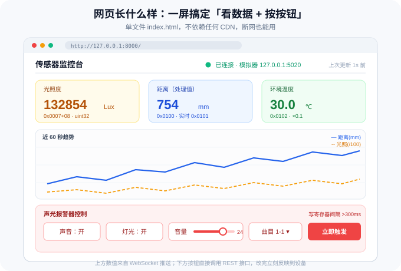

# 第 6 篇：前端网页与联调测试

> **本篇目标**
> 写一个**单文件网页**：左边看数据，右边按按钮。
> 然后把整套系统用 **pytest + 模拟器**跑一遍自动化测试，最后接上真硬件做验收。
>
> 预计 **25 分钟**。

> ▶ **怎么运行**：这一篇要频繁启停服务，**强烈建议用点按钮的方式**——
> 在 VSCode 里打开 `run.py` 点右上角 **▶** 就能起服务；要 `--with-simulator` 就点右边的 **▾** 选启动项。
> 懒得点的话，命令行备选见 [导读 · 第六节](README.md)。

---

## 一、网页要长什么样



**四个区域，从上到下：**

| 区域 | 内容 | 数据来源 |
| :--- | :--- | :--- |
| 顶栏 | 标题、连接状态灯、"上次更新 x 秒前" | WebSocket 状态 |
| 指标卡 ×3 | 光照度 Lux / 距离 mm / 温度 ℃ | `/ws/stream` 推送 |
| 趋势图 | 近 60 秒的曲线（距离 + 光照） | 前端本地缓存 |
| 控制面板 | 声音、灯光、音量、曲目、播放模式、一键全开/全关 | `POST /api/alarm/*` |

**两条硬要求：**

1. **不依赖任何 CDN**——图表用原生 Canvas 画，不加外部 `<script src="https://...">`。断网、内网都能用。
2. **断线要能自愈**——WebSocket 断了自动重连（指数退避），顶栏状态灯要如实反映。

---

## 二、⭐ 提示词 A：前端单页

> WorkBuddy → **「允许完全访问」** → 新建任务 → 整段复制。

````text
# 任务：为 RS485 传感器监控平台写一个单文件前端网页

## 背景
项目根目录 = **当前工作目录下的 `sensor-hub` 子目录**。开工前先 `Get-Location` 确认；
如果我在这段对话里另行指定了路径，以我指定的为准；
**不要写死盘符或用户名路径**，并在你输出的第一行先报告实际使用的绝对路径。
后端已完成（FastAPI，默认 http://127.0.0.1:8000），提供：
  GET  /api/health       → {"ok":true,"data":{"transport":"simulator","uptime_s":..,"devices":[..]}}
  GET  /api/snapshot     → {"ok":true,"data":{<snapshot>},"message":""}
  GET  /api/config       → {"ok":true,"data":{..},"message":""}
  WS   /ws/stream        → {"type":"snapshot","data":{<snapshot>}}
  POST /api/alarm/switch      {"on": true}
  POST /api/alarm/volume      {"level": 15}
  POST /api/alarm/track       {"folder": 1, "track": 3}
  POST /api/alarm/mode        {"mode": 1}
  POST /api/alarm/flash       {"sync": 1, "mode": 1}
  POST /api/ultrasonic/config {"range_level": 3}

snapshot 结构（**不要猜字段名，按这个来**；示例数值只是示意，
**各字段的合法范围、单位、状态名以 `docs/protocol.md` 为准**）：
{
  "ts": 1726464000.123,
  "ok": true,
  "errors": [],
  "light":      {"ok":true,"illuminance_lux":20019,"device_address":1,"baud_code":3},
  "ultrasonic": {"ok":true,"processed_mm":754.0,"realtime_mm":751.0,"temperature_c":30.0,
                 "echo_us":4336,"status":"ok","range_level":2,"angle_level":3,"denoise_level":1},
  "alarm":      {"ok":true,"sound":true,"light":true,"volume":12,"folder":1,"track":1,
                 "play_mode":1,"flash_sync":1,"flash_mode":1,
                 "total_folders":1,"total_tracks":6}
}
设备读取失败时该子对象为 {"ok":false,"error":"原因"}。
ultrasonic.status 取值："ok" / "interference"（同频干扰）/ "no_object"（未检测到物体）。

## 交付物
只写一个文件：static/index.html（内联 CSS 和 JS，不要拆分，不要外部依赖）。

## 布局要求（自上而下）
1) 顶栏：左侧标题「传感器监控台」；右侧一个状态圆点 + 文字（未连接/已连接）+「上次更新 X 秒前」（每秒刷新）。
2) 指标卡一行三张：
   · 光照度：显示 lux，带千分位；小于 1 万显示一位小数
   · 距离：主显示处理值 mm（整数），副显示实时值 mm
   · 温度：一位小数 ℃
   每张卡片右下角用小字标注数据来源（**地址从 docs/protocol.md 取**，写成「寄存器 0xXXXX」的形式）。
   读取失败（ok=false）时该卡片整体变灰并显示「读取失败：原因」。
3) 趋势图：一块 Canvas（高度约 140px，宽度自适应父容器）。
   · 保留最近 60 个采样点（约 60 秒）
   · 画两条线：距离(mm) 用实线；光照(/100) 用虚线，两条线各自自动缩放（归一化到各自最大最小值），
     并在图例处标明「已归一化，仅看趋势」
   · 坐标轴画浅色网格线，不要刻度数字（保持简洁）
   · 窗口 resize 时要重绘（用 ResizeObserver 或 window.onresize + devicePixelRatio 处理清晰度）
4) 控制面板（放在一个带边框的区域内）：
   · 声音：开/关 两个状态按钮（或一个 toggle），当前状态高亮
   · 灯光：同上
   · 音量：range 滑块（**取值范围取 docs/protocol.md**），拖动松手后才发请求（用 change 而不是 input），旁边显示当前值
   · 曲目：两个下拉框（文件夹 1~total_folders，曲目 1~total_tracks），选完立即生效
   · 播放模式：单曲循环 / 单曲播放
   · 闪烁模式：同步/不同步 + 爆闪/频闪/旋转/左右闪/常亮
   · 一个醒目的「一键全开」和「全部关闭」按钮
   · 每次操作后：按钮短暂显示「处理中…」，成功显示 ✓ 并刷新显示，失败弹一个提示条显示 message
5) 底部：一行小字显示当前 transport 和轮询间隔（数据来自 /api/config）。

## 交互与技术细节
- 启动流程：先 fetch /api/config 和 /api/snapshot 渲染首屏，再建立 WebSocket。
- WebSocket 地址自动推导：根据 location.protocol 选 ws:// 或 wss://，host 用 location.host。
- 断线自动重连：1s → 2s → 4s → 8s，最大 15s；重连成功重置退避。
- 所有 POST 用 fetch + JSON，统一处理 {"ok":false,"message":...} 的错误。
- 未连接时，控制面板的所有按钮置为 disabled 并显示提示。
- 数值要做防抖：WebSocket 每秒推一次，直接重绘没问题，但不要每次重绘都重建 DOM 元素。
- 视觉风格：浅色主题，白底 + 浅灰边框，主色 #2563EB，警告色 #EF4444，成功色 #10B981。
  字体使用系统字体栈（"Microsoft YaHei", "PingFang SC", sans-serif）。
- 代码要有清晰的分区和注释（配置区 / 状态区 / 渲染区 / 网络区 / 事件区）。

## 自测（必须实际执行）
1. 用 `uv run python run.py --with-simulator` 启动后端（或先起模拟器再起服务）。
2. 用浏览器打开 http://127.0.0.1:8000/ ，确认：
   · 三张卡片都有数值且随时间变化
   · 趋势图在动
   · 状态灯是绿色
3. 逐个测试控制按钮（音量、曲目、模式、一键全开/全关），确认页面上状态跟着变。
4. 故意停掉后端，确认状态灯变红、按钮禁用、页面上仍保留最后一次数据；
   重启后端，确认 15 秒内自动恢复。
5. 用 curl 直接调一次 /api/alarm/volume 改成 20，确认页面上 1 秒内自动跟上（说明推送生效）。
6. 输出自检报告表格：| 检查项 | 结果 |

## 约束
- 不要引入任何外部库或 CDN 资源；不要用框架。
- 不要修改后端代码；接口不够用就先告诉我。
- 页面必须在 1366×768 及以上分辨率下正常显示，不要出现横向滚动条。
- 真实输出，禁止编造：自检要真的在浏览器里把每个检查项跑一遍，把看到的现象如实写进报告，不要凭想象描述界面。
- 卡片上标注的数据来源「寄存器 0xXXXX」、音量滑块的取值范围等，一律从 `docs/protocol.md` 取；若该文件不存在，先停下来问我，不要凭记忆填数字。
````

---

## 三、⭐ 提示词 B：自动化测试 + 真机验收

````text
# 任务：为 RS485 传感器项目补齐自动化测试，并产出真机验收清单

## 背景
项目根目录 = **当前工作目录下的 `sensor-hub` 子目录**。开工前先 `Get-Location` 确认；
如果我在这段对话里另行指定了路径，以我指定的为准；
**不要写死盘符或用户名路径**，并在你输出的第一行先报告实际使用的绝对路径。
已完成：app/modbus_base.py、app/devices.py、app/hub.py、app/simulator.py、app/server.py、
        static/index.html、tools/ 下调试工具、**docs/protocol.md（协议摘要）**。tests/ 目录为空。

> ⚠️ 测试里用到的寄存器地址、量程、特殊值、取值范围，**全部从 `docs/protocol.md` 取**。
> 不许出现"我印象里是这样"的数字。

## 第一部分：pytest 自动化测试（tests/）
要求：
1) 用 conftest.py 提供 session 级 fixture，启动 app.simulator 到**非默认端口 15020**（避免和
   手动调试时的 5020 冲突），测试结束后干净关闭。
   启动方式建议用 subprocess（因为模拟器是常驻服务），并等待端口可用后再 yield。
2) 所有测试默认连模拟器，**不依赖任何真实硬件**；如果检测到环境变量 SENSOR_TEST_SERIAL=1
   则额外跑一组真实串口的冒烟测试（用 pytest.mark.skipif 控制）。

必须覆盖的用例：
tests/test_light.py
  · 读测量值：返回数值类型，且落在摘要标注的量程范围内（**不要断言固定值**）
  · 连续读 3 次，值在合理范围内波动
  · 读设备地址返回摘要里的出厂值
  · **官方样例复现**：把摘要里的「原文样例」写成断言，证明换算公式写对了
tests/test_ultrasonic.py
  · read_all() 返回的字典包含全部约定字段
  · 温度解码正确：向模拟器写入一个已知原始值，确认按摘要的换算得到对应温度
  · **负温度**：写入对应的负原始值，确认能正确读回负温度（验证有符号处理）
  · **异常值**：让模拟器分别注入摘要里标注的两种异常值，确认对应读方法返回 None，
    且 read_all()["status"] 变成摘要里定义的对应状态名
  · **换算自检**：摘要里由同一物理量派生出的两个寄存器（例如「回波时间」与「距离」）
    互相换算比对；误差阈值优先取摘要里写明的，摘要没写就用 ±5mm **并注明这是你的假设**
tests/test_alarm.py
  · read_state() 返回全部约定字段且类型正确（sound/light 为 bool，volume 为 int）
  · set_volume(合法值) 后读回等于该值
  · set_volume(低于下限) 和 set_volume(高于上限) 都被拒绝（返回 False），
    且**没有发出任何串口请求**（上下限取摘要）
  · set_track(合法文件夹, 合法曲目) 后读回与写入一致
  · **位域互不干扰**：只翻转声音位，灯光位读回不受影响
  · 一次「读-写-读」序列全部成功，验证锁没有死锁
tests/test_concurrency.py
  · 起 4 个线程，2 个持续读光照度、2 个持续读超声波，跑 3 秒，
    断言所有调用都成功（无 CRC 错误、无 None），以此验证串口串行化生效。
tests/test_api.py（用 fastapi.testclient）
  · GET /api/health 返回 ok=true
  · GET /api/snapshot 结构完整（用 jsonschema 或手工断言每个必需字段）
  · POST /api/alarm/volume {"level":15} 返回 ok=true 且 data 里 volume==15
  · POST /api/alarm/volume {"level":99} 返回 ok=false（不是 500）
  · 危险接口默认返回 403

3) 所有断言失败时要给出可读的信息（用 pytest 的 assert 消息或 pytest.fail）。
4) 运行 `uv run pytest -v` 与 `uv run pytest --tb=short -q`，把真实输出贴出来。
5) 统计并报告：用例总数、通过数、失败数、耗时。

## 第二部分：真机验收清单（产出一份 硬件验收.md）
生成文件 `硬件验收.md`，内容包括：

A. 接线检查表
   · 电源：型号/电压/正负极颜色
   · 485：A/B 对应关系、总线拓扑（**本项目经 485 集线器星型接入，属正常方案**；
     仅当无集线器、多台设备直接挂同一对线时，才要求手拉手菊花链、避免长星型分支）
   · 终端电阻：线长超过多少米需要加 120Ω
   · 三台设备的地址表（设备名 / 出厂地址 / 计划地址 / 波特率）
B. 上电顺序与冒烟步骤（按顺序执行，每步给出命令和期望结果）
   1. 只接一台设备 → scan_ports.py 确认 COM 口
   2. scan_slaves.py --baud-scan 找到波特率和地址
   3. regtool.py 读一个已知寄存器，确认数值合理
   4. 逐台接入并改地址（每次只接一台！报警器文档要求改地址时总线上只能有一台设备）
   5. 全部接上后 scan_slaves.py 应能一次扫到全部地址
C. 功能验收表（每项：操作 / 期望 / 实际 / 通过）
   · 光照度：遮挡感光面数值应明显下降
   · 超声波：手在传感器前移动，距离读数跟随变化
   · 报警器：控制开/关、音量 5 与 30 有明显响度差、爆闪可见
   · 网页：数值实时刷新、控制按钮生效、断线重连
D. 常见故障处置表（现象 / 可能原因 / 处置）

## 约束
- 测试必须能在**没有任何硬件**的机器上全绿通过。
- 不要为了让测试通过而放宽断言（比如把「必须 >0」改成「不报错」）。
- 检查 `.vscode/launch.json` 并更新「跑全部测试」启动项为 `pytest -v`（第 1 篇已建，**有就更新、不要重复添加**）。
- 测试中发现驱动 bug，**先汇报再改**，并把修改点列出来。
- 真实输出，禁止编造。
- 若 `docs/protocol.md` 不存在，先停下来告诉我，不要凭记忆编造测试数据或取值范围。
````

---

## 四、真机联调：动手前先确认两件事

**接线、改地址、统一波特率、总线验收——这些全部在
[第 3 篇 · 真机接入与总线组网](03-真机接入与总线组网.md) 里做完了。**
本篇只关心"软件怎么跑在真机上"，不再重复硬件的活。

**开始之前，确认下面几条已经完成：**

- [ ] 三台设备已改成**互不相同**的从机地址（规划值：1 / 2 / 3）
- [ ] 三台波特率已**统一**
- [ ] 三台接到 **485 集线器**，集线器上行口 → USB 转 485 转换器 → 电脑
- [ ] `config.yaml` 的 `devices` 段已按实测值填好
- [ ] 第 3 篇的**总线稳定性测试**已通过（300 轮没有明显失败）

> ⚠️ 任何一条没做到，**先回 [第 3 篇](03-真机接入与总线组网.md)**。
> 在一条地址冲突、参数不一致的总线上调软件，只会把**硬件问题误判成代码问题**，越查越乱。

### 切到真机，只改一处配置

```yaml
transport: serial      # 从 simulator 改成 serial
serial:
  port: COM3           # 改成你机器上转换器的 COM 口
  baudrate: 9600       # 与统一后的波特率一致
```

改完在 VSCode 里打开 `run.py`，点右上角 **▶** 就跑真实设备（带参数的入口点 ▶ 右边的 **▾**）。
**不用改任何代码** —— 这正是驱动层同时支持 serial / simulator 的意义。

### 上电顺序（每次冷启动都照这个来）

1. **先断所有电**再接线
2. 先上 **485 转换器**，再上**传感器电源**
3. 等 2 秒（部分设备上电后需要初始化时间）
4. 最后启动采集程序

> 顺序反了不会烧设备，但会出现"刚开始那几秒读不到"的假故障。

---

## 五、验收清单

**A 段：软件层（有模拟器就能全验）**

| # | 检查项 | 期望 |
| :---: | :--- | :--- |
| 1 | pytest 全绿 | 0 failed |
| 2 | 并发无 CRC 错误 | 4 线程压测 3 秒全通过 |
| 3 | 异常值被正确翻译 | 摘要里标注的异常值 → status 变化 |
| 4 | API 非法参数被拒 | 返回 `ok=false`，非 500 |
| 5 | 危险接口默认 403 | 已关闭 |
| 6 | 网页实时刷新 | 1 秒更新一次 |
| 7 | 断线自愈 | ≤15 秒恢复 |

**B 段：整机联调（真机验证）**

> 前提：已通过 [第 3 篇](03-真机接入与总线组网.md) 的总线验收（扫到 3 个地址 + 稳定性达标）。

| # | 检查项 | 期望 |
| :---: | :--- | :--- |
| 8 | 切到真机不改代码 | 只改 `config.yaml` 就能跑 |
| 9 | 光照度合理 | 室内几百~几千 Lux，遮挡后**明显下降** |
| 10 | 距离合理 | 手在跟前读数**变小**，远离**变大** |
| 11 | 温度合理 | 与室温接近，误差 ±2℃ 内 |
| 12 | 报警器可控 | 开/关、音量、曲目都生效 |
| 13 | 网页能看能控 | 曲线在动；点按钮后**读回值跟着变** |
| 14 | 长时间运行稳定 | 连续跑 30 分钟不掉线、不涨内存 |
| 15 | 改配置不改代码 | 换串口号只动 `config.yaml` |

---

## 六、排错手册

| 现象 | 可能原因 | 怎么处置 |
| :--- | :--- | :--- |
| 网页一直「未连接」 | 后端没起 / 端口被占 | 看后端控制台；换 `--port` |
| 网页有数据但不动 | 采集线程挂了 | 看后端日志有无异常堆栈 |
| 数值偶尔跳到 65534 / 65533 | 特殊值没处理 | 检查驱动是否处理了摘要里标注的异常值 |
| 数值偶尔是 None | 采样超时 | 加大 timeout、降低轮询频率 |
| 报警器命令时而无效 | 命令间隔不足 | 确认设备的 `gap_ms` 已按摘要设置 |
| 报警器只响灯不响声音 | 可能是另一个型号 | 看 [第 4 篇](04-三个传感器驱动开发.md)「关于型号差异」 |
| 换了台电脑跑不起来 | 依赖没同步 | `uv sync`，串口号在 `config.yaml` 里改 |
| **看起来是"软件问题"，其实是总线问题** | 地址冲突 / 未共地 / 无终端电阻 | **回 [第 3 篇](03-真机接入与总线组网.md) 的排错手册**——硬件层问题在这里查不出根因 |

---

## 七、参考链接

| 名称 | 链接 |
| :--- | :--- |
| FastAPI 测试（TestClient） | <https://fastapi.tiangolo.com/tutorial/testing/> |
| pytest 官方文档 | <https://docs.pytest.org/> |
| Canvas 2D API | <https://developer.mozilla.org/zh-CN/docs/Web/API/Canvas_API> |
| WebSocket API | <https://developer.mozilla.org/zh-CN/docs/Web/API/WebSocket> |

---

⬅️ 上一篇：[第 5 篇 · 实时采集与控制后端](05-实时采集与控制后端.md)　|　🏠 返回 [导读](README.md)
