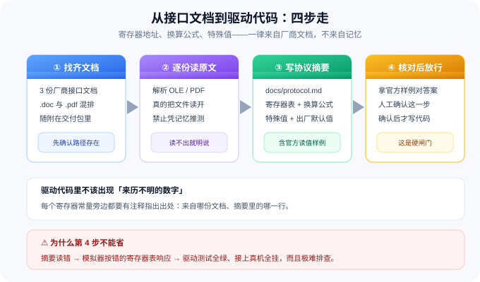
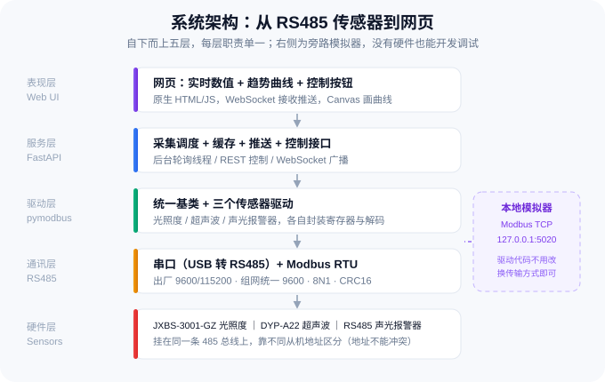
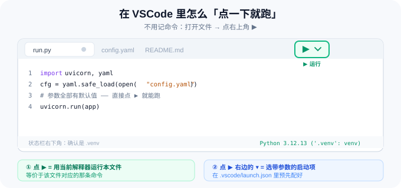
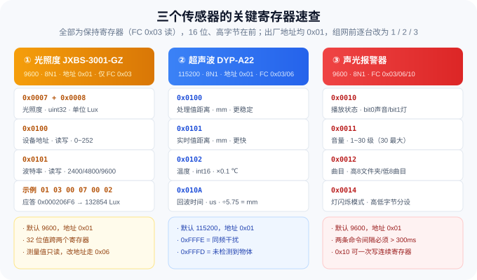

# 传感器监控平台 · 教学文档（导读）

> **这个项目要做什么**
> 用 Python + pymodbus 把三个 RS485 传感器接起来，写成可调试的驱动函数；
> 再写一个**网页**，能**实时看数据**、也能**按下按钮控制设备**。
> 全套文档按「环境 → 链路 → **总线组网** → 驱动 → 后端 → 网页联调」六步走，
> **每一步都配一段可直接复制给 AI 智能体的提示词**。
>
> 🔌 **三台设备通过一个 485 集线器汇到一路**。组网前必须先逐台改从机地址、统一波特率——
> 这一环单独成篇（[第 3 篇](03-真机接入与总线组网.md)），并顺带把 RS485 总线原理讲清楚。
>
> ⚙️ **本套文档不直接给你寄存器表**——协议事实由你**指挥 AI 读取厂商接口文档**总结成
> `docs/protocol.md`，再由你核对（见 [第二节](#二三份厂商接口文档本套的题目)）。
> 这是刻意设计的：**"让 AI 把说明书读成工程规格"本身就是核心技能。**
>
> 📦 **本套文档是自包含的**：7 个 md + 配图 + 随附的厂商接口文档，**整个文件夹拷走就能用**，内部跳转全部是相对路径。

---

## 一、硬件清单

| # | 设备 | 型号 | 作用 | 通讯 |
| :---: | :--- | :--- | :--- | :--- |
| 1 | 光照度变送器 | **JXBS-3001-GZ**（485 型） | 测光照，输出 Lux | Modbus RTU（参数见接口文档） |
| 2 | 超声波测距模组 | **DYP-A22**（RS485 版） | 测距离 + 板载温度 | Modbus RTU（参数见接口文档） |
| 3 | 声光报警器 | RS485 报警器 V2.3 | **被控设备**：发声 + 闪灯 | Modbus RTU（参数见接口文档） |

**共用硬件**

| 硬件 | 作用 |
| :--- | :--- |
| **USB 转 RS485 转换器** | 电脑端出口，装好驱动后会出现 `COMx` |
| **485 集线器**（本项目用它） | 把三台设备汇到一路：星型布线、端口隔离，接线整齐好维护 |
| **12~24V DC 电源** | 光照度变送器 12-24V；超声波 3.3~12V；报警器按铭牌 |
| 485 连接线 | **A 接 A、B 接 B**，接反了完全不通；三台 **GND 必须共地** |

> 🧩 **接线拓扑**：三台设备 → **485 集线器**各端口；集线器**上行口** → USB 转 485 → 电脑。
> 拓扑图、RS485 总线原理和完整接线要点见
> [第 3 篇 · 真机接入与总线组网](03-真机接入与总线组网.md)。

> ⚠️ **两个必须提前知道的坑**
> 1. 三台设备的**出厂从机地址是同一个** → 直接挂到一条总线上会互相冲突，**必须先逐台改地址**；
> 2. 三台**波特率不一定相同** → 需要统一成一个值。
>
> **485 集线器解决不了这两件事**——它只负责"分线"。改地址 + 统一波特率 + 总线验收的完整流程，
> 见 [第 3 篇](03-真机接入与总线组网.md)。具体数值请从接口文档里读。

---

## 二、三份厂商接口文档（本套的「题目」）



**本套文档刻意不把寄存器表直接给你。** 三台设备长什么样，要从随附的三份厂商接口文档里读出来：

| 文件名 | 对应设备 | 格式 |
| :--- | :--- | :--- |
| `JXBS-3001-GZ 485型光照度变送器V1.0.doc` | 光照度变送器 | Word 97 |
| `声光报警器  RS485 ModBus_RTU 通讯协议V2.3.pdf` | 声光报警器 | PDF |
| `超声波传感器DYP-RD-产品规格书(DYP-A22-V1.0)-230522-A0（雷达）.pdf` | 超声波测距模组 | PDF |

这不是偷懒，是**故意的**：真实工作里，你手上只有厂商的说明书，没有"标准答案"。
本套文档要训练的核心能力是——**指挥 AI 把文档读透、总结成可用的工程规格，再由你核对**。

### 你要让 AI 从文档里总结出什么

| 要总结的内容 | 为什么关键 |
| :--- | :--- |
| **通讯参数** | 出厂从机地址、波特率、数据位 / 校验 / 停止位——错一个字节，链路就是不通 |
| **寄存器表** | 地址、读写权限、数据类型（uint16 / int16 / uint32 / 位域）、单位、换算公式、取值范围、出厂默认值 |
| **特殊值** | 厂商定义的「干扰 / 未检测到」等取值，直接当正常数值用会得到离谱结果 |
| **时序约束** | 命令最小间隔、响应时间——忽略了就会出现「时好时坏」这种最难查的毛病 |
| **原文样例** | 文档里给的官方读值样例，是你**唯一能对答案的东西** |

### 这一步在第 2 篇里做

[第 2 篇](02-串口链路打通与模拟器.md) 的提示词会让智能体：

```
找到文档 → 逐份读原文 → 产出 docs/protocol.md → 停下来交你确认
                                                    ↑ 人工闸门
```

确认之后，第 3、4、5 篇的提示词只需引用 `docs/protocol.md`，**不再重复任何协议内容**。

> ⚠️ **一个必须提前知道的坑**：三台设备的**出厂从机地址是同一个，而波特率互不相同**。
> 挂到同一条总线之前必须逐台改地址、并统一波特率，否则互相冲突、谁也读不到。
> **485 集线器也救不了这个问题**（它只负责分线）。完整流程见
> [第 3 篇 · 真机接入与总线组网](03-真机接入与总线组网.md)。具体数值请从文档里读。

> 📌 **文档放哪儿**：提示词只会在**当前目录、上一级目录、名为 `通讯协议文档/` 的子目录**这三处找接口文档。
> **最省事的做法**：把「传感器监控平台」整个文件夹设为 WorkBuddy 的工作区——文档已在其中，AI 自己就能找到。
> 放在别处也行，找不到时 AI 会停下来向你要路径。

> 📎 想知道 AI 交上来的摘要对不对？→ 看文末 [**附录 A：协议摘要参考答案**](#附录-a协议摘要参考答案验收用)。
> **但请先让它自己总结完，再去看。**

---

## 三、系统架构



**分层职责**

| 层 | 做什么 | 不做什么 |
| :--- | :--- | :--- |
| 表现层 | 网页展示数值/曲线，发控制指令 | 不直接碰串口 |
| 服务层 | 定时轮询、缓存最新值、WebSocket 推送、暴露控制接口 | 不解码寄存器 |
| 驱动层 | 把「寄存器原始值」翻译成「业务量」（Lux / mm / ℃） | 不管 HTTP |
| 通讯层 | 串口参数、Modbus RTU 帧、CRC | 不管业务 |

**一个关键设计**：驱动层**同时支持串口和 Modbus TCP**。这样在**没有硬件**的时候，可以起一个本地模拟器（Modbus TCP，`127.0.0.1:5020`）把整套软件跑通——**换传输方式不用改一行驱动代码**。

---

## 四、学习路径

> **第 0 步（贯穿全程）：先让 AI 把接口文档读透。**
> 第 2 篇的第一件事就是这个——产出 `docs/protocol.md` 之后，后面每一步都引用它。


| # | 文档 | 你会得到什么 | 提示词 |
| :---: | :--- | :--- | :---: |
| 1 | [环境搭建与项目骨架](01-环境搭建与项目骨架.md) | uv + Python 3.12 + 全套依赖 + 规范目录结构 | 1 |
| 2 | [串口链路打通与本地模拟器](02-串口链路打通与模拟器.md) | **读接口文档产出协议摘要** + 串口工具 + 免硬件的本地模拟器 | 2 |
| 3 | [真机接入与总线组网](03-真机接入与总线组网.md) | **RS485 总线原理 + 逐台改地址 + 统一波特率 + 集线器组网与总线联调** | 3 |
| 4 | [三个传感器驱动开发](04-三个传感器驱动开发.md) | 统一基类 + 三个驱动类 + 各自的调试脚本（**核心**） | 2 |
| 5 | [实时采集与控制后端](05-实时采集与控制后端.md) | FastAPI 服务：轮询采集 + 缓存 + WebSocket 推送 + 控制接口 | 1 |
| 6 | [前端网页与联调测试](06-前端网页与联调测试.md) | 单文件网页 + pytest 自动化测试 + 真机验收清单 | 2 |

**合计约 2 小时 40 分钟**（含接线与联调），共 **11 段提示词**。

**两条线并行，不用等硬件：**

```
第 1、2 篇  ── 纯软件，有电脑就能做完（全程用本地模拟器验证）
      ↓
第 3 篇     ── 开始碰真机：改地址、统一波特率、接集线器、总线验收
      ↓
第 4~6 篇   ── 驱动 / 后端 / 网页，模拟器和真机都能跑
```

急的话，**第 2、3、4 篇是核心**：先把协议读透、把总线搞稳，再写代码。

---

## 五、目标项目结构

**提示词里没有写死任何路径。** 每段提示词都会明确要求智能体：

1. 先打印「当前工作目录」确认（`Get-Location`）；
2. 把**当前工作目录下的 `sensor-hub`** 作为项目根目录（目录名可在提示词里改）；
3. 在第一行报告它实际使用的**绝对路径**；
4. **不得使用任何写死的盘符或用户名路径**（别人的机器不一样）。

推荐的项目结构如下（`sensor-hub` 即项目根目录）：

```
sensor-hub/
├── pyproject.toml            ← uv 管理的依赖清单
├── config.yaml               ← 串口、波特率、地址、轮询间隔（所有默认值都在这）
├── run.py                    ← 一键启动（后端 + 网页）
├── docs/
│   └── protocol.md           ← ★ 从厂商接口文档总结出来的协议摘要（全程的唯一依据）
├── .vscode/
│   ├── settings.json         ← 固定解释器为 .venv
│   └── launch.json           ← 配好「点 ▶ 就能跑」的启动项
├── app/
│   ├── __init__.py
│   ├── modbus_base.py        ← 统一基类（串口 / TCP 两种传输）
│   ├── devices.py            ← 三个传感器驱动
│   ├── hub.py                ← 采集调度 + 缓存
│   ├── simulator.py          ← 本地 Modbus 从机模拟器
│   └── server.py             ← FastAPI 后端
├── static/
│   └── index.html            ← 前端单页
├── tools/
│   ├── scan_ports.py         ← 枚举串口
│   ├── scan_slaves.py        ← 扫从机地址
│   └── regtool.py            ← 通用寄存器读/写
└── tests/
    └── test_devices.py       ← 基于模拟器的单元测试
```

---

## 六、怎么启动：优先点按钮，命令行只作备选



**目标：不用记命令，点一下就跑。**

### 首选：在 VSCode 里点 ▶

```
① 打开项目文件夹（文件 → 打开文件夹 → 选 sensor-hub）
      ↓
② 打开要运行的那个 .py 文件
      ↓
③ 点编辑器右上角的 ▶ 按钮（或按 Ctrl + F5）
```

▶ 会用**当前选中的解释器**去跑这个文件。只要右下角显示的是 `.venv`，跑出来的就是项目环境。

> ⚠️ 第一次跑之前，先按 `Ctrl+Shift+P` → `Python: 选择解释器` → 选中带 `.venv` 的那一项。
> 选错了会报「找不到 pymodbus」这类模块错误。

### 带参数的入口：用 ▶ 右边的 ▾

▶ 右边有个小三角 **▾**，点开可以选「预先配好的启动项」。项目里已经放了 `.vscode/launch.json`，
把常用入口都配好了：

| 启动项 | 作用 | 等价命令（备选） | 可用自 |
| :--- | :--- | :--- | :---: |
| **启动监控服务** | 起后端 + 网页（默认连模拟器） | `uv run python run.py` | 第 5 篇后 |
| **启动本地模拟器** | 只起模拟器，不占网页端口 | `uv run python -m app.simulator` | 第 2 篇后 |
| **调试光照度** | 光照度调试脚本 | `uv run python tools/debug_light.py` | 第 4 篇后 |
| **调试超声波** | 超声波调试脚本 | `uv run python tools/debug_ultrasonic.py` | 第 4 篇后 |
| **调试报警器（只读）** | 报警器脚本 dry-run，不会真响 | `uv run python tools/debug_alarm.py` | 第 4 篇后 |
| **扫描串口** | 列出本机 COM 口 | `uv run python tools/scan_ports.py --only-usb` | 第 2 篇后 |
| **扫描从机地址** | 扫从机地址 | `uv run python tools/scan_slaves.py` | 第 2 篇后 |
| **总线稳定性测试** | 300 轮轮询三台（[第 3 篇](03-真机接入与总线组网.md) 用） | `uv run python tools/bus_soak.py` | 第 3 篇后 |
| **跑全部测试** | pytest | `uv run pytest -v` | 第 6 篇后 |

> ⚠️ **第 1 篇刚做完时，上表大部分启动项还只是「空壳」**——点了会报 `NotImplementedError`，
> 这不是坏了，是对应篇章还没做到。按「可用自」这一列判断什么时候能点。

也可以按 `Ctrl + Shift + D` 打开「运行和调试」面板，下拉里挑一个，按 `F5` 启动。

**要改参数**（比如连真实串口）：直接改 `config.yaml`，或者编辑 `launch.json` 里对应配置的 `args`，例如：

```json
"args": ["--transport", "serial", "--port", "COM3"]
```

### 一条设计约束：每个入口「不给参数也能跑」

提示词里已经写死了这条要求：**所有默认值从 `config.yaml` 读，命令行参数只作临时覆盖。**

```
想连真实串口 → 改 config.yaml     （不用敲参数、不用改代码）
想临时试一下 → 加命令行参数        （不改配置文件）
```

### 备选：命令行（保留，不删）

批量执行、写脚本、接 CI，或者手边没有 VSCode 的时候用命令行：

```powershell
uv run python run.py                          # 起服务（默认读 config.yaml）
uv run python run.py --transport serial --port COM3
uv run python -m app.simulator
uv run python tools/scan_ports.py --only-usb
uv run python tools/debug_light.py
uv run pytest -v
```

> 两种方式**跑的是同一套代码、同一个 `.venv`**，只是入口不同。
> 点按钮适合日常，命令行适合自动化。

---

## 七、四条使用约定

**1）提示词怎么用**

每篇文档里的提示词都放在 ```` ```text ```` 代码块里，**整段复制**给智能体即可。
提示词是**自包含**的——目标、产出、约束、验收标准都写全了，智能体不用再问你"要做什么"。

> 但有一件事**必须由它自己去查**：**设备协议**。寄存器地址、换算公式、特殊值都在
> `docs/protocol.md`（由它读厂商接口文档总结）里，提示词里**刻意不重复**。

建议：

- 打开 WorkBuddy，**切到「允许完全访问」**（只有该模式能读写文件、执行命令）
- 一次只喂**一段**提示词，**跑完并验收后再喂下一段**；一篇里有多段提示词时，按文中 A → B → C 的顺序来
- 提示词末尾都要求「输出自检报告」，**先看报告再决定要不要继续**
- 真机写操作不靠对话确认：专用脚本 `set_identity.py` **默认 dry-run、加 `--yes` 才写入**——别嫌麻烦，那是在保护你的设备

**2）协议知识由 AI 去读，不由本套文档给出**

> 🚫 **本套文档不提供寄存器表**，也**不要复制粘贴任何既有脚本或网上的例程**。
> 一切协议事实，都来自 **AI 读取厂商接口文档后产出的 `docs/protocol.md`**。

理由很实在：

- 抄来的代码往往带着别人的串口号、波特率和地址假设，**出了问题是查不出来的**；
- 真实项目里你拿到的就是厂商说明书，**"让 AI 把文档读成规格"本身就是核心技能**。

**3）随附的接口文档**

三份厂商原件随交付包一起给你（清单见 [第二节](#二三份厂商接口文档本套的题目)）。

> 📌 **正文不依赖这些文件的位置**——放在本套 md 的**同目录**、或 `通讯协议文档/` 子目录里都能用。
> 其中光照度那份是 **Word 97 格式的 `.doc`**，普通文本工具打不开——
> 这正好是第一道考题：**看 AI 怎么把它读出来**（提示词里给了思路）。

> ✅ **一个自检小技巧**：AI 交摘要时，让它把**文档里给出的官方读值样例**一并贴出来。
> 那是唯一能"对答案"的东西，也是判断它到底是真读了、还是在编的最好办法。

**4）危险操作：改从机地址 / 改波特率**

> ⚠️ 这两类操作会**真的改动设备**。写错寄存器，或者在总线上还挂着别的设备时写入，
> 可能把设备改成你找不到的地址——**只能靠"全地址段扫描"把它捞回来**。

保护措施（[第 3 篇](03-真机接入与总线组网.md) 的专用脚本 `tools/set_identity.py` 已把它们固化成代码，请照做）：

1. 脚本**默认不写入**：运行后选一下接的是哪台设备，它自动从 `config.yaml` 取串口和波特率、
   打印写入计划（哪个寄存器、旧值、新值、依据），**输入 y（或加 `--yes`）才真正写入**；
   写入前先扫描，发现总线上**不是恰好一台设备**就拒绝执行；
2. **一次只接一台设备**——总线上有别的设备时写地址，可能改到不该改的那台；
3. 改完必须**断电重启**，脚本会等你回车后自动读回确认；
4. **只改地址寄存器和波特率寄存器**，其他寄存器一律不写（脚本直接拒绝）；
5. 改完把实际值同步进 `config.yaml`，别让配置和实物对不上（脚本会打印建议片段）。

---

## 八、开始阅读

👉 [第 1 篇 · 环境搭建与项目骨架](01-环境搭建与项目骨架.md)

---

## 附录 A：协议摘要参考答案（验收用）

> ⚠️ **这一节是给「核对答案的人」看的。**
> 请在 AI 交出 `docs/protocol.md` 之后再翻到这页；**不要提前贴给它**——那等于替它做完了作业。
> 判断标准不是"和下面完全一致"，而是：**关键事实有没有读错、有没有漏**。



### A.1 8 条最容易读错的（重点核对）

| 核对点 | 读错的后果 | 正确答案 |
| :--- | :--- | :--- |
| 光照度的位宽 | 当成单个 uint16 → 值永远是错的 | **32 位值跨两个寄存器**：`(高 << 16) \| 低` |
| 温度的数据类型 | 当无符号 → 冬天读出 6553.5℃ | **有符号 int16，单位 0.1℃**；`if raw >= 0x8000: raw -= 0x10000` 再 ÷10 |
| 回波时间的换算 | 直接当 mm 用 → 差 5.75 倍 | **`mm = 回波值 ÷ 5.75`** |
| 距离寄存器里的特殊值 | 当距离用 → 65534mm / 65533mm | `0xFFFE` = 同频干扰、`0xFFFD` = 未检测到物体 → 应返回 `None` |
| 报警器音量的范围 | 传百分比 → 设备不响应或爆音 | **1~30 级**（30 最大，`0x001E`） |
| 报警器曲目编码 | 直接写曲目号 → 播错曲子 | **高 8 位文件夹 + 低 8 位曲目**（`0x0102` = 第 1 个文件夹第 2 首） |
| 报警器状态寄存器 | 当成整体数值 → 改一个功能带偏另一个 | **位域**：bit0=声音，bit1=灯光 |
| 报警器命令间隔 | 连写多条 → 时好时坏 | **两条命令间隔 > 300ms**（用 `gap_ms` 满足） |

### A.2 ① 光照度变送器 JXBS-3001-GZ

| 寄存器 | PLC 地址 | 内容 | 读写 |
| :--- | :--- | :--- | :---: |
| `0x0007` | 40008 | 光照度高字节（单位 1 Lux） | 只读 |
| `0x0008` | 40009 | 光照度低字节（单位 1 Lux） | 只读 |
| `0x0100` | 40101 | 设备地址（0~252） | 读写 |
| `0x0101` | 40102 | 波特率（2400 / 4800 / 9600） | 读写 |

- 通讯：**9600 · 8N1 · 出厂地址 `0x01`**，**只用到功能码 `0x03`**
- **官方样例**：读 `0x0007` 起 2 个寄存器 → `0x0002, 0x06F6` → `0x000206F6` = **132854 Lux**

### A.3 ② 超声波 DYP-A22

| 寄存器 | 内容 | 说明 |
| :--- | :--- | :--- |
| `0x0100` | 处理值距离 | uint16，mm，响应约 100~300ms，更稳 |
| `0x0101` | 实时值距离 | uint16，mm，响应约 15~140ms，更快 |
| `0x0102` | 温度 | int16，单位 0.1℃ |
| `0x010A` | 回波时间 | uint16，us，`mm = 值 ÷ 5.75` |

- 通讯：**115200 · 8N1 · 出厂地址 `0x01`**
- 配置区（读写）：`0x0200` 从机地址 · `0x0201` 波特率代码 · `0x0206` 开关量门限 ·
  `0x0208` 角度等级(1~4) · `0x0209` 输出单位 · `0x021A` 降噪等级 · `0x021F` 量程等级(1~4)
- 波特率代码：`0x0009` = 115200（其余见原文表）
- 特殊值：`0xFFFE` 同频干扰 · `0xFFFD` 未检测到物体

### A.4 ③ 声光报警器

| 寄存器 | 内容 | 取值说明 |
| :--- | :--- | :--- |
| `0x0010` | 播放状态 | 位域：bit0=声音，bit1=灯光。`0x0000` 全关 / `0x0001` 声音 / `0x0002` 灯光 / `0x0003` 全开 |
| `0x0011` | 音量 | 1~30 级（出厂 `0x001E`） |
| `0x0012` | 音调（曲目） | 高 8 位文件夹号 + 低 8 位曲目号 |
| `0x0013` | 播放模式 | `0x0001` 单曲循环 / `0x0002` 单曲播放 |
| `0x0014` | 灯闪烁模式 | 高 8 位：`01` 不同步 / `02` 同步；低 8 位：`01` 爆闪 / `02` 频闪 / `03` 旋转 / `04` 左右闪 / `05` 常亮 |
| `0x0080` | 总曲目 | 只读。高 8 位文件夹数，低 8 位曲目数 |
| `0x0020` | 从机地址 | 出厂 `0x0001` |

- 通讯：**9600 · 8N1 · 出厂地址 `0x01`**，支持 `0x03` 读 / `0x06` 写单个 / `0x10` 写多个
- ⚠️ 两条命令间隔 **> 300ms**；**改从机地址时总线上只能挂这一台设备**
- 出错码：`01` 非法功能码 · `02` 非法寄存器地址 · `03` 非法数据 · `07` CRC 校验错
- 型号差异：文档还提到「三元信号型」，其中灯光的颜色位放在高 8 位（`01` 红 / `02` 黄 / `04` 绿），
  且关灯时高 8 位不能发 `00`。本项目按**普通 485 型**实现，但要在代码里留出切换开关。

### A.5 改地址 / 改波特率要写哪个寄存器（[第 3 篇](03-真机接入与总线组网.md) 会用到）

| 设备 | 地址寄存器 | 地址范围 | 波特率寄存器 | 备注 |
| :--- | :--- | :--- | :--- | :--- |
| 光照度变送器 | `0x0100` | 0~252 | `0x0101` | 波特率取 2400 / 4800 / 9600 |
| 超声波测距模组 | `0x0200` | 见原文 | `0x0201` | 波特率用"代码"表示，对照原文表换算 |
| 声光报警器 | `0x0020` | 见原文 | 见原文 | 改地址时**总线上只能挂这一台** |

**规划值（项目约定）**：从机地址 **1 / 2 / 3**；波特率**统一 9600**。

> ⚠️ **如果摘要里找不到某台设备的"波特率寄存器"**，不要瞎试——
> 保持它出厂波特率，并把其他设备统一到同一个值。
> 这正是本项目把波特率统一到 **9600** 的原因之一：低速率兼容性最好。

---

**本套文档是独立的**——可以直接把整个文件夹打包交给别人，不依赖任何外部文件。

交付内容：**7 个 md**（本篇 + 6 篇正文）+ **`images/`**（10 张配图）+ **随附的厂商接口文档 3 份**。

---

**文档更新日期**：2026 年 9 月 16 日
**协议依据**：厂商原始文档（光照度 Ver1.0 / 报警器 V2.3 / 超声波 DYP-A22-V1.0），
由**智能体读取后总结**为项目内的 `docs/protocol.md`
